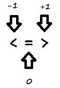

# Glossary
**Refactoring** is just a fancy way of saying we're improving the structure or appearance of our code without changing what it actually does.

----

**Constants**: A Ruby constant is like a variable, except that its value is supposed to remain constant for the duration of the program. The Ruby interpreter does not actually enforce the constancy of constants, but it does issue a warning if a program changes the value of a constant.
```
A_CONST = 10  
A_CONST = 20  
```
Produces a warning:
```
warning: already initialized constant A_CONST  
```
Lexically, the names of constants look like the names of local variables, except that they begin with a capital letter. By convention, most constants are written in all uppercase with underscores to separate words, LIKE_THIS. Ruby class and module names are also constants, but they are conventionally written using initial capital letters and camel case, LikeThis.

----
# Ruby - Useful Info

## <a name='The.splitMethod-Dividingandreplacingpartsofauserinput'></a>The .split Method - Dividing and replacing parts of a user input
Next, we'll want to divide the user's input into individual words.

Ruby has a built-in method for this called .split; it takes in a string and returns an array. If we pass it a bit of text in parentheses, .split will divide the string wherever it sees that bit of text, called a delimiter. For example, `text.split(“,”)` tells Ruby to split up the string text whenever it sees a comma.

EG
```
puts "Input text to be redacted "
text = gets.chomp
puts "Word to be redacted "
redact = gets.chomp
words = text.split(" ")
words.each do |x|
  if x == redact
    print "REDACTED "
  else 
    print x + " "
  end
end
```

------ 
## <a name='Methods'></a>Methods

A method is a reusable section of code written to perform a specific task in a program. You might be wondering why you need to separate your code into methods, rather than just writing everything out in one big chunk. It turns out there are a few good reasons to divide your programs into methods:

+ If something goes wrong in your code, it's much easier to find and fix bugs if you've organized your program well. Assigning specific tasks to separate methods helps with this organization.

+ By assigning specific tasks to separate methods (an idea computer scientists call separation of concerns), you make your program less redundant and your code more reusable—not only can you repeatedly use the same method in a single program without rewriting it each time, but you can even use that method in another program.

When we learn more about objects, you'll find out there are a lot of interesting things we can do with methods in Ruby.


--------
## <a name='sortexplained'></a>.sort explained

https://stackoverflow.com/questions/26581619/rubys-operator-and-sort-method 

Before you can understand sorting objects. You need to understand the .sort method in Ruby. If you were to sort 5 cards with numbers on them, you could take a look at all of them, find the lowest one easily, and just pick that one as your first card (presuming you're sorting from lowest to highest, which Ruby does). When your brain sorts, it can look at everything and sort from there.
There are 2 main elements of confusion here that are rarely addressed:
1) Ruby can't sort in the way you think of the word "sort". Ruby can only 'swap' array elements, and it can 'compare' array elements.
2) Ruby uses a comparison operator, called the spaceship, to attribute numbers to help it 'sort'. Those numbers are -1,0,1. People erroneously think those 3 numbers are helping it 'sort' (eg. if there was an array with 3 numbers such a 10,20,30, then the 10 would be a -1, the 20 a 0, and the 30 a 1, and Ruby is just simplifying the sorting by reducing it to -1,0,1. This is wrong. Ruby can't "sort". It can't only compare).

Look at the spaceship operator. It's 3 individual operators lumped into one, the <, the =, and the >. When Ruby compares two variables, it results in one of these numbers.



That said, what does "results" mean? It DOESN'T mean that one of the variables is assigned a 0,1,-1. It simply is a way what Ruby can take two variables and do something with them. Now, if you just run:
```
puts 4 <=> 5
```
You'll get the result of -1, since whatever 'part' (eg. <, =, or >) of the comparison operator (spaceship) is true, gets the number that's assigned to it (as seen in the above picture). When Ruby sees this <=> with an array though, it has 2 things it will do to the array only: Leave the array alone OR swap the elements of the array.

If Ruby uses the <=> and gets a 1, it will swap the 2 elements of the array. If Ruby gets a result of -1 or 0, it will leave the array alone.

An example is if Ruby sees the array [2,1]. The sort method would make it pull in these figures like 2<=>1. Since the part of the spaceship (if you want to think of it like that) that's true is the > (ie. 2>1 is true), the result is '1' from Ruby. When Ruby sees a 1 result from the spaceship, it swaps the 2 elements of the array. Now the array is [1,2].

Hopefully at this point, you see that Ruby only compares with the <=> operator, and then swaps (or leaves alone) the 2 elements in the array it compares.

Understand the .sort method is an iterative method, meaning that it's a method that runs a block of code many times. Most people are introduced to the .sort method only after they've seen a methods such as .each or .upto (you don't need to know what those do if you haven't heard of them), but those methods run through the array 1 time ONLY. The .sort method is different in that it will run through your array as many times as it needs to so that it's sorted (by sorted, we mean compared and swapped).

To make sure you understand the Ruby syntax:
```
foo = [4, 5, 6] puts foo.sort {|a,b| a <=> b}
```
The block of code (surrounded by {}'s) is what Ruby would do any way when it sorts from lowest to highest. But suffice it to say that the first iteration of the .sort method will assign the variables between the pipes (a, b) the first two elements of the array. So for the first iteration a=4 and b=5, and since 4<5, that results in a -1, which Ruby takes it to mean to NOT swap the array. It does this for a second iteration, meaning a=5 and b=6, sees that 5<6, results in -1 and leaves the array alone. Since all the <=> results were -1, Ruby stops looping through and feels the array is sorted at [4,5,6].

We can sort from high to low by simply swapping the order of the variables.
```
bar = [5, 1, 9] puts bar.sort {|a,b| b <=> a}
```
Here's what Ruby is doing:

+ Iteration 1: Array [5,1,9]. a=5, b=1. Ruby sees the b<=>a, and says is 1 < 5? Yes. That results in -1. Stay the same.

+ Iteration 2: Array [5,1,9]. a=1, b=9. Ruby sees the b<=>a, and says is 9 < 1? No. That results in 1. Swap the 2 array elements. The array is now [5,9,1]

+ Iteration 3: Array [5,9,1]. Starting over b/c there was a +1 result in the array before going through it all. a=5, b=9. Ruby sees the b<=>a, says is 9<5? No. That results in 1. Swap. [9, 5, 1]

+ Iteration 4: Array [9,5,1]. a=5, b=1. Ruby sees the b<=>a, says is 1<5? Yes. That results in -1. Therefore, no swapping is performed. Done. [9,5,1].

Imagine an array with the number 50 for the first 999 elements, and a 1 for element 1000. You fully understand the sort method if you realize Ruby has got to go through this array thousands of times doing the same simple compare and swap routine to shift that 1 all the way to the beginning of the array.

Now, we can finally look at .sort when comes to an object.
```
def <=>(other) other.score <=> score end
```
This should now make a little more sense. When the .sort method is called on an object, like when you ran the:
```
@players.sort
```
it pulls up the "def <=>" method with the parameter (eg. 'other') which has the current object from @players (eg. 'whatever the current instance object is of '@players', since it's the sort method, it's eventually going to go through all of the elements of the '@players' array). It's just like when you try to run the puts method on a class, it automatically calls the to_s method inside that class. Same thing for the .sort method automatically looking for the <=> method.

Looking at the code inside of the <=> method, there must be a .score instance variable (with an accessor method) or simply a .score method in that class. And the result of that .score method should (hopefully) be a String or number - the 2 things ruby can 'sort'. If it's a number, then Ruby uses it's <=> 'sort' operation to rearrange all of those objects, now that it knows what part of those objects to sort (in this case, it's the result of the .score method or instance variable).

As a final tidbit, Ruby sorts alphabetically by converting it to numerical values as well. It just considers any letter to be assigned the code from ASCII (meaning since upper case letters have lower numerical values on the ASCII code chart, upper case will be sorted by default to be first).
Hope this helps!

----------
## <a name='DefaultParameters'></a>Default Parameters
Let's start with the new bit of code you saw in exercise 1:
```
def alphabetize(arr, rev=false)
```
The first part makes sense—we're defining a method, alphabetize. We can guess that the first parameter is an array, but what's this rev=false business?
What this does is tell Ruby that alphabetize has a second parameter, rev (for "reverse") that will default to false if the user doesn't type in two arguments. You might have noticed that our first call to alphabetize in exercise 1 was just
alphabetize(books)
Ruby didn't see a rev, so it gave it the default value of false.
 
### <a name='SettingaDefaultforHashes'></a>Setting a Default for Hashes 
You don't have to settle for nil as a default value, however. If you create your hash using the Hash.new syntax, you can specify a default like so:
my_hash = Hash.new("Trady Blix")
Now if you try to access a nonexistent key in my_hash, you'll get "Trady Blix" as a result.

------------
## <a name='WhatsaSymbol'></a>What's a Symbol?

You can think of a Ruby symbol as a sort of name. It's important to remember that symbols aren't strings:
```
"string" == :string # false
```

Above and beyond the different syntax, there's a key behavior of symbols that makes them different from strings. While there can be multiple different strings that all have the same value, there's only one copy of any particular symbol at a given time.

Symbols always start with a colon (:). They must be valid Ruby variable names, so the first character after the colon has to be a letter or underscore (_); after that, any combination of letters, numbers, and underscores is allowed.

Make sure you don't put any spaces in your symbol name—if you do, Ruby will get confused.
```
:my symbol # Don't do this!
:my_symbol # Do this instead.
```
### <a name='WhatareSymbolsUsedFor'></a>What are Symbols Used For?
Symbols pop up in a lot of places in Ruby, but they're primarily used either as hash keys or for referencing method names. (We'll see how symbols can reference methods in a later lesson.)
```
sounds = {
  :cat => "meow",
  :dog => "woof",
  :computer => 10010110,
}
```
Symbols make good hash keys for a few reasons:
+ They're immutable, meaning they can't be changed once they're created;
+ Only one copy of any symbol exists at a given time, so they save memory;
+ Symbol-as-keys are faster than strings-as-keys because of the above two reasons.

Converting between strings and symbols is a snap.
```
:sasquatch.to_s # ==> "sasquatch"
"sasquatch".to_sym # ==> :sasquatch
```
The .to_s and .to_sym methods are what you're looking for!

EG:
``` 
strings = ["HTML", "CSS", "JavaScript", "Python", "Ruby"]
symbols = Array.new
strings.each do |s|
  symbols.push(s.to_sym)
end 
```
Besides using .to_sym, you can also use .intern. This will internalize the string into a symbol and works just like .to_sym:
```
"hello".intern # ==> :hello
```
When you're looking at someone else's code, you might see .to_sym or .intern (or both!) when converting strings to symbols.

----
## <a name='FilteringHashes'></a>Filtering Hashes

We know how to grab a specific value from a hash by specifying the associated key, but what if we want to filter a hash for values that meet certain criteria? For that, we can use .select.

```
grades = { alice: 100,
  bob: 92,
  chris: 95,
  dave: 97
}

grades.select { |name, grade| grade <  97 } # ==> { :bob => 92, :chris => 95 }

grades.select { |k, v| k == :alice } # ==> { :alice => 100 }
```

In the example above, we first create a grades hash that maps symbols to integers.

Then we call the .select method and pass in a block of code. The block contains an expression for selecting matching key/value pairs. It returns a hash containing :bob and :chris.

Finally, we call the .select method again. Our block looks only for the key :alice. This is an inefficient method of getting a key/value pair, but it shows that .select does not modify the hash.

(Here we're using "name" or "k" to stand for the key and "grade" or "v" to stand for the value, but as usual with blocks, you can call your variables whatever you like.)

### <a name='Eg'></a>Eg

```
movie_ratings = {
  memento: 3,
  primer: 3.5,
  the_matrix: 5,
  truman_show: 4,
  red_dawn: 1.5,
  skyfall: 4,
  alex_cross: 2,
  uhf: 1,
  lion_king: 3.5
}
# Add your code below!
good_movies = movie_ratings.select do |key, value|
  value > 3
end
```
----
## <a name='IteratingOutPartsofaHash'></a>Iterating Out Parts of a Hash

Ruby includes two hash methods, .each_key and .each_value, that do exactly what you'd expect:
```
my_hash = { one: 1, two: 2, three: 3 }

my_hash.each_key { |k| print k, " " } # ==> one two three

my_hash.each_value { |v| print v, " " } # ==> 1 2 3
```
### <a name='Eg-1'></a>Eg
```
movie_ratings = {
  memento: 3,
  primer: 3.5,
  the_matrix: 3,
  truman_show: 4,
  red_dawn: 1.5,
  skyfall: 4,
  alex_cross: 2,
  uhf: 1,
  lion_king: 3.5
}
movie_ratings.each_key {|key| puts key} # puts the name of each movie
movie_ratings.each_value {|value| puts value} # puts the rating of each movie.
```
---
## <a name='ShorteningIf'></a>Shortening "If"
### <a name='TheCaseStatement'></a>The Case Statement

if and else are powerful, but we can get bogged down in ifs and elsifs if we have a lot of conditions to check. Thankfully, Ruby provides us with a concise alternative: the case statement. The syntax looks like this:

```
case language
  when "JS"
    puts "Websites!"
  when "Python"
    puts "Science!"
  when "Ruby"
    puts "Web apps!"
  else
    puts "I don't know!"
end
```
The else is what the case statement will do if it doesn't match any of its when statements to the case (in this case, the value of language).

To make the code more concise, you can fold the statements:

```
case language
  when "JS" then puts "Websites!"
  when "Python" then puts "Science!"
  when "Ruby" then puts "Web apps!"
  else puts "I don't know!"
end
```
another example:
```
puts "Hello there!"
greeting = gets.chomp.downcase

# Add your case statement below!
case greeting 
  when "english" then puts "Hello!"
  when "french" then puts "Bonjour!"
  when "german" then puts "Guten Tag!"
  when "finnish" then puts "Haloo!"
  else puts "I don't know that language!"
end
```
### <a name='ifandunless'></a>if and unless 
You've seen the Ruby if statement before:
```
if condition
  # Do something!
end
```
If the "do something" is a short, simple expression, however, we can move it up into a single line (as you saw in the last exercise). The syntax looks like this:
expression if boolean
Ruby will expect an expression followed by if followed by a boolean. The order is important. You can do this:
puts "It's true!" if true
but not this:
```
if true puts "It's true!"
```

It's also important to note that you don't need an end when you write your if statement all on one line.

#### <a name='EgSimpleCoinTossgame'></a>Eg Simple Coin Toss game

```
assignments = {heads: 0, tails: 1}
puts "heads or tails?"
user_choice = gets.chomp.downcase.to_sym
flip = rand(2)
puts "heads" if flip == 0 
puts "tails" if flip == 1
puts "you lose" if assignments[user_choice] != flip
puts "you win" if assignments[user_choice] == flip
```
Alternatively, the unless condition works the other way around:

```
assignments = {heads: 0, tails: 1}
puts "heads or tails?"
user_choice = gets.chomp.downcase.to_sym
flip = rand(2)
puts "heads" if flip == 0 
puts "tails" if flip == 1
puts "you lose" unless assignments[user_choice] == flip
puts "you win" unless assignments[user_choice] != flip
```
### <a name='TernaryConditionalExpressions'></a>Ternary Conditional Expressions

An even more concise version of if/else is the ternary conditional expression. It's called "ternary" because it takes ***three arguments***: a boolean, an expression to evaluate if the boolean is true, and an expression to evaluate if the boolean is false.
The syntax looks like this:
boolean ? Do this if true: Do this if false
An example might be:

#### <a name='Eg-1'></a>Eg
```
puts 3 < 4 ? "3 is less than 4!" : "3 is not less than 4."
```
#### <a name='Eg-1'></a>Eg

```
assignments = {heads: 0, tails: 1}
puts "heads or tails?"
user_choice = gets.chomp.downcase.to_sym
flip = rand(2)
puts "heads" if flip == 0 
puts "tails" if flip == 1
puts assignments[user_choice] == flip ? "you win" : "you lose"
```
#### <a name='Eg-1'></a>Eg
```
print "Enter a number: "
i = gets.to_i
puts "Your number is " +
(i > 10 ? "greater than" : "less than or equal to") +
" 10"
```
---
## <a name='ConditionalAssignment'></a>Conditional Assignment

We've seen that we can use the = operator to assign a value to a variable. But what if we only want to assign a variable if it hasn't already been assigned? 
For this, we can use the conditional assignment operator: ||=. It's made up of the or (||) logical operator and the normal = assignment operator.

#### <a name='Eg-1'></a>Eg
```
favorite_language ||= "ruby"
puts favorite_language
```
---

## <a name='Short-CircuitEvaluation'></a>Short-Circuit Evaluation
Recall that we have the boolean operators and (&&) and or (||) in Ruby. The && operator only returns true when the expressions on both sides of the operator are true; || returns true when one or the other or both of the expressions involved are true. 
Ruby does this via short-circuit evaluation. That means that Ruby doesn't look at both expressions unless it has to; if it sees
```
false && true
```
it stops reading as soon as it sees && because it knows false && anything must be false.

Remember how Ruby returns the result of the last expression it evaluated? We can use that to show short-circuit evaluation in action.

#### <a name='Eg-1'></a>Eg
```
def a
  puts "A was evaluated!"
  return true
end

def b
  puts "B was also evaluated!"
  return true
end

puts a || b
puts "------"
puts a && b
```
results in:
```
A was evaluated!
true
------
A was evaluated!
B was also evaluated!
true
```

Because only false and nil are false values in Ruby, both strings are treated as true. Ruby knows true || anything is true, so in a || b, it only evaluates a. Since it might encounter a false in the b part of a && b, however, it has to evaluate b, which we see in the result!

----

## <a name='BasicIterationstechniques'></a>Basic Iterations techniques
Sooner or later, you're going to need to perform a repetitive task in your programs. Many programming languages allow you to do this with a for loop, and while Ruby does include for loops, there are better tools available to us.

### <a name='times'></a>.times
If we want to do something a specific number of times, we can use the .times method, like so:
```
5.times { puts "Odelay!" }
# Prints 5 "Odelay!"s on separate lines
```
If we want to repeat an action for every element in a collection, we can use .each:
```
[1, 2, 3].each { |x| puts x * 10 }
# Prints 10, 20, 30 on separate lines
```
#### <a name='Eg-1'></a>Eg
```
my_array = [1, 2, 3, 4, 5, 6, 7, 8, 9, 10]
my_array.each {|x| puts x if x%2==0}
# puts only even numbers from the array
```
### <a name='upto.downto'></a>.upto .downto
If we know the range of numbers we'd like to include, we can use .upto and .downto. This is a much more Rubyist solution than trying to use a for loop that stops when a counter variable hits a certain value.
We might use .upto to print out a specific range of values:
```
95.upto(100) { |num| print num, " " }
# Prints 95 96 97 98 99 100
and we can use .downto to do the same thing with descending values.
```
----- 
## <a name='Debugging'></a>Debugging  
### <a name='CallandResponse'></a>Call and Response
Remember when we mentioned that symbols are awesome for referencing method names? Well, .respond_to? takes a symbol and returns true if an object can receive that method and false otherwise. For example,
```
[1, 2, 3].respond_to?(:push)
would return true, since you can call .push on an array object. However,
[1, 2, 3].respond_to?(:to_sym)
would return false, since you can't turn an array into a symbol.
```
----- 
## <a name='Blocks'></a>Blocks
### <a name='Thecollectmethod'></a>The collect method
The collect method takes a block and applies the expression in the block to every element in an array. Check it out:
```
my_nums = [1, 2, 3]
my_nums.collect { |num| num ** 2 }
# ==> [1, 4, 9]
```

If we look at the value of my_nums, though, we'll see it hasn't changed:
```
my_nums
# ==> [1, 2, 3]
```

This is because .collect returns a copy of my_nums, but doesn't change (or mutate) the original my_nums array. If we want to do that, we can use .collect! with an exclamation point:

```
my_nums.collect! { |num| num ** 2 }
# ==> [1, 4, 9]
my_nums
# ==> [1, 4, 9]
```
### <a name='Blocksandyielding'></a>Blocks and yielding

A block is simply a chunk of code, and yield allows you to "inject" that code at some place into a function. So if you want your function to work in a slightly different way, you don't have to write a new function, instead you can reuse the one you already have, but give it a different block.

For example, consider a function that will print the members of an Array, but number them, like this: if you give it ["apple","banana"], it should print
```
1. apple
2. banana
```
Easy enough, right? There are several ways to do this, but I'll just use each and a counter. Instead of incrementing the counter via += 1, I'd like to use the next method (you'll see why in a moment). Here's how the next method works: 3.next equals 4, 99.next is 100 and so on. So here's our method (without yield):
```
def print_list(array, first = 1)
  counter = first
  array.each do |item|
    puts "#{counter}. #{item}"
    counter = counter.next
  end
end
```
Now when we call print_list(["Ruby", "Python", "C"]), it'll print
```
1. Ruby
2. Python
3. C
```
The second parameter first is optional (it defaults to 1 because of the first=1 above) and it tells our function where to start counting:
```
print_list(["a","b","c"], 99)
```
will print
```
99. a
100. b
101. c
```
Because I chose next over += 1 to increment the counter, and because Ruby is really awesome, we can use strings instead of numbers to label the list items: "A".next is "B", and so forth. Thus
```
print_list(["Ruby", "Python", "C"], "X")
```
will print:
```
X. Ruby
Y. Python
Z. C
```
Great, right? But what if we wanted a different format for the item labels? Say, (1), (2), (3) instead of 1., 2., 3.? Our function does the formatting in this line:
```
puts "#{counter}. #{item}"
```
So instead of having two (almost identical) functions – one for 1. 2. and one for (1) (2) (and so on, one for every possible idea), we're going to export that formatting thing into a block, and have just a yield inside the function:
```
# function print_list, line 4:
puts "#{yield counter} #{item}"
```
Now we can have a block handle the formatting:
```
print_list( [1,2,3], 23 ) { |n| "<#{n}>"}

# produces: 

<23> 1
<24> 2
<25> 3
```
Now I hope you see how this yield adds flexibility to your method. You can, for instance, have something like this:
```
print_list( ["alpha","beta","gamma"], 5 ) do |n|
  "[#{100*n}]:"
end
```
----

## <a name='Procs'></a>Procs


Procs are easy to define! You just call Proc.new and pass in the block you want to save. Here's how we'd create a proc called cube that cubes a number (raises it to the third power):
```
cube = Proc.new { |x| x ** 3 }
```
We can then pass the proc to a method that would otherwise take a block, and we don't have to rewrite the block over and over!
```
[1, 2, 3].collect!(&cube)
# ==> [1, 8, 27]
[4, 5, 6].map!(&cube)
# ==> [64, 125, 216]
```
(The .collect! and .map! methods do the exact same thing.)

The & is used to convert the cube proc into a block (since .collect! and .map! normally take a block). We'll do this any time we pass a proc to a method that expects a block.

#### <a name='Eg-1'></a>Eg
```
floats = [1.2, 3.45, 0.91, 7.727, 11.42, 482.911]
round_down = Proc.new {|x| x.floor}
ints = floats.collect(&round_down)
print ints 
# [1, 3, 0, 7]
```
The same result achieved using methods only would look as follows:

```
floats = [1.2, 3.45, 0.91, 7.727, 11.42, 482.911]
def round_down(x)
 x.collect {|y| y.floor}
end
ints = round_down(floats)
```
Procs are full-fledged objects, so they have all the powers and abilities of objects. (Blocks do not.)
Unlike blocks, procs can be called over and over without rewriting them. This prevents you from having to retype the contents of your block every time you need to execute a particular bit of code.

Calling a proc with a method isn't too tricky. However, there's an even easier way.
Unlike blocks, we can call procs directly by using Ruby's .call method. Check it out!
```
test = Proc.new { # does something }
test.call
# does that something!
```
Remember: there's always more than one way to do something in Ruby.

### <a name='SymbolsMeetProcs'></a>Symbols, Meet Procs

Now that you're learning some of the more complex parts of the Ruby language, you can combine them to work some truly arcane magicks. For instance, remember when we told you that you could pass a Ruby method name around with a symbol? Well, you can also convert symbols to procs using that handy little &.
Check it out:
```
strings = ["1", "2", "3"]
nums = strings.map(&:to_i)
# ==> [1, 2, 3]
```
In this instance, 
```
stings.map(&:to_i)
```
is shorthand for:
```
strings.map{|string| string.to_i}
```
### <a name='TheRubyLambda'></a>The Ruby Lambda
Like procs, lambdas are objects. The similarities don't stop there: with the exception of a bit of syntax and a few behavioral quirks, lambdas are identical to procs.
Typing:
```
lambda { puts "Hello!" }
```
Is just about the same as
```
Proc.new { puts "Hello!" }
```
In the example to the right, when we pass the lambda to lambda_demo, the method calls the lambda and executes its code.

Lambdas are defined using the following syntax:
```
lambda { |param| block }
```
Lambdas are useful in the same situations in which you'd use a proc. 

#### <a name='eg'></a>eg
```
strings = ["leonardo", "donatello", "raphael", "michaelangelo"]
symbolize = lambda {|x| x.to_sym}
symbols = strings.collect(&symbolize)
print symbols
# -> [:leonardo, :donatello, :raphael, :michaelangelo]
 ```

 Lambdas vs. Procs

There are only two main differences.

1. First, a lambda checks the number of arguments passed to it, while a proc does not. This means that a lambda will throw an error if you pass it the wrong number of arguments, whereas a proc will ignore unexpected arguments and assign nil to any that are missing.
2. Second, when a lambda returns, it passes control back to the calling method; when a proc returns, it does so immediately, without going back to the calling method.

####  <a name='eg-1'></a>eg 
```
def batman_ironman_proc
  victor = Proc.new { return "Batman will win!" }
  victor.call
  "Iron Man will win!"
end

puts batman_ironman_proc

def batman_ironman_lambda
  victor = lambda { return "Batman will win!" }
  victor.call
  "Iron Man will win!"
end

puts batman_ironman_lambda

# -> Batman will win! 
# -> Iron Man will win!
```
#### <a name='eg-1'></a>eg
```
my_array = ["raindrops", :kettles, "whiskers", :mittens, :packages]
symbol_filter = lambda {|x| x.is_a? Symbol}
symbols = my_array.select(&symbol_filter)
puts symbols
# -> [:kettles, :mittens, :packages]
```

####  <a name='eg-1'></a>eg
```
crew = {
  captain: "Picard",
  first_officer: "Riker",
  lt_cdr: "Data",
  lt: "Worf",
  ensign: "Ro",
  counselor: "Troi",
  chief_engineer: "LaForge",
  doctor: "Crusher"
}
first_half = lambda {|title, name| name<"M"}
a_to_m = crew.select(&first_half)
puts a_to_m

# -> {:lt_cdr=>"Data", :chief_engineer=>"LaForge", :doctor=>"Crusher"}
```

#### <a name='Summary'></a>Summary 
A block is just a bit of code between do..end or {}. It's not an object on its own, but it can be passed to methods like .each or .select.
A proc is a saved block we can use over and over.
A lambda is just like a proc, only it cares about the number of arguments it gets and it returns to its calling method rather than returning immediately.

----
## <a name='ClassSyntax'></a>Class Syntax

A basic class consists only of the class keyword and the name of the class. Check it out:
```
    class NewClass
      # Class magic here
    end
```
Our NewClass has the ability to create new Ruby objects of class NewClass (just like "Hello!" is a String and 4 is a Fixnum). By convention, class names start with a capital letter and use CamelCase instead of relying_on_underscores.

### <a name='InstanceVariables'></a>Instance Variables
In Ruby, we use @ before a variable to signify that it's an instance variable. This means that the variable is attached to the instance of the class.
```
class Car
  def initialize(make, model) 
    @make = make
    @model = model
  end
end

kitt = Car.new("Pontiac", "Trans Am")
```

The code in the example above creates an instance, kitt, of the class Car. kitt has his own @make ("Pontiac") and @model ("Trans Am"). Those variables belong to the kitt instance, which is why they're called instance variables.

#### <a name='eg-1'></a>eg
```
class Person
  def initialize(name)
    @name = name
  end
end
```
This tells Ruby that whenever it creates a Person, it has to have a name, and each instance of Person will have its own @name.

To inspect the object, we use the terminal command : 

``` 
p 
```
### <a name='Attributereaders'></a>Attribute readers

#### <a name='Askingforinformation'></a>Asking for information

Remember how we initially said that people have the ability to remember their name, and tell it, when asked?

We’ve already implemented the first part of this. Our person instance now knows her name “Ada”.

Let’s look at the second part. You also remember that methods are either questions or commands. We want to add a method that implements answering the question “What’s your name?”.

And it is as simple as this:

class Person
```
def initialize(name)
    @name = name
  end

  def name
    @name
  end
end
```
Before we discuss what this does, let’s look at how we can use our new method. We can now call the method on the person object, like this:
```
person = Person.new("Ada")
puts person.name
```
So this prints the name Ada, and that’s what we want: we can create a new person object, passing a name to it. Once that person has been created we are able to ask for its name, and we’ll get the name back.

How does this work, exactly, under the microscope?

Let’s walk through it, step by step:

On the first line, the object that ends up being assigned to the variable person is an initialized, new instance of the class Person. By “intialized” we mean that the method initialize has already been called, and it already has assigned the string "Ada" to the instance variable @name.

Now this person object has the method name, as defined in the class definition of Person above, and in the second line we call this method: person.name.

When the method name is called, it does nothing else but evaluate the instance variable @name from the object scope. Because this has previously been set to "Ada" it will return this string. And because this is the last line in the method name the method also will return this string.

For that reason the method call person.name returns the string "Ada", which is then passed to puts, which prints it out.

Methods that do nothing else but return a value assigned to an instance variable with the same name are very common.

In fact they are so common that there’s a word for them: they are called “attribute readers”. By “attribute” the Ruby community means an instance variable, so an attribute reader is a method that reads an instance variable.

An attribute reader returns the value of an instance variable.

Another way of looking at this is that an attribute reader is a method that “exposes” an instance variable. It makes it accessible for others. I.e. it allows you to ask for the value of an instance variable with the same name, and does nothing but return its value. Once defined others can ask this object for knowledge that otherwise would be private, and unaccessible.

#### <a name='eg-1'></a>eg
```
class Person
  def initialize(name)
    @name = name
  end
  def name
    @name
  end
end 
matz = Person.new("Yukihiro")
puts "Hello #{matz.name}"
# -> Hello Yukihiro
```
### <a name='ScopeitOut'></a>Scope it Out
Another important aspect of Ruby classes is scope. The scope of a variable is the context in which it's visible to the program.

It may surprise you to learn that not all variables are accessible to all parts of a Ruby program at all times. When dealing with classes, you can have variables that are available everywhere (global variables), ones that are only available inside certain methods (local variables), others that are members of a certain class (class variables), and variables that are only available to particular instances of a class (instance variables).

The same goes for methods: some are available everywhere, some are only available to members of a certain class, and some are only available to particular instance objects.

```
class Computer
  $manufacturer = "Mango Computer, Inc."
  @@files = {hello: "Hello, world!"}
  
  def initialize(username, password)
    @username = username
    @password = password
  end
  
  def current_user
    @username
  end
  
  def self.display_files
    @@files
  end
end

# Make a new Computer instance:
hal = Computer.new("Dave", 12345)

puts "Current user: #{hal.current_user}"
# @username belongs to the hal instance.

puts "Manufacturer: #{$manufacturer}"
# $manufacturer is global! We can get it directly.

puts "Files: #{Computer.display_files}"
# @@files belongs to the Computer class.
```
returns:
```
Current user: Dave
Manufacturer: Mango Computer, Inc.
Files: {:hello=>"Hello, world!"}
```
#### <a name='eg-1'></a>eg
```
class Person
  def initialize(name)
    @name = name
  end
  def name
    @name
  end
end 
$matz = Person.new("Yukihiro")
def define
  puts "Hello #{$matz.name}"
end
define
```
returns
```
Hello Yukihiro
```
### <a name='Inheritance'></a>Inheritance

Inheritance is the process by which one class takes on the attributes and methods of another, and it's used to express an is-a relationship.

In Ruby, inheritance works like this:
```
class DerivedClass < BaseClass
  # Some stuff!
end
```
The derived class is the new class you're making and the base class is the class from which that new class inherits. You can read "<" as "inherits from."

### <a name='Override'></a>Override!
Sometimes you'll want one class that inherits from another to not only take on the methods and attributes of its parent, but to override one or more of them.

For instance, you might have an Email class that inherits from Message. Both classes might have a send method that sends them, but the e-mail version may have to identify valid e-mail addresses and use a bunch of e-mail protocols that Message knows nothing about. Rather than add a send_email method to your derived class and inherit a send method you'll never use, you can instead just explicitly create a send method in the Email class and have it do all the email-sending work.

This new version of send will override (that is, replace) the inherited version for any object that is an instance of Email.

#### <a name='eg-1'></a>eg

```
class Creature
  def initialize(name)
    @name = name
  end
  
  def fight
    puts "#{@name} gives a punch to the chops!"
  end
end

# Add your code below!
class Dragon < Creature
  def fight
    puts "#{@name} breathes fire!"
  end
end
  
carl = Creature.new("Carl")
carl.fight
bruce = Dragon.new("Bruce")
bruce.fight
```
returns:
```
Carl gives a punch to the chops!
Bruce breathes fire!
```

Any given Ruby class can have only one superclass. Some languages allow a class to have more than one parent, which is a model called multiple inheritance. This can get really ugly really fast, which is why Ruby disallows it.

### <a name='AccessingClassAttributes'></a>Accessing Class Attributes
Ruby needs methods in order to access attributes.

#### <a name='eg-1'></a>eg
```
class Person
  def initialize(name, job)
    @name = name
    @job = job
  end
  
  def name
    @name
  end
  
  def job=(new_job)
    @job = new_job
  end
end

new_person = Person.new("Greg", "Builder")
p new_person
new_person.job=("Plumber")
p new_person
```
returns
```
# <Context::Person:0x000000015d7f90 @name="Greg", @job="Builder">
# <Context::Person:0x000000015d7f90 @name="Greg", @job="Plumber">
```
(That name= might look funny, but you're allowed to put an = sign in a method name. That's just a Ruby convention saying, "hey, this method sets a value!")

We can use attr_reader to access a variable and attr_writer to change it. If we write
```
class Person
  attr_reader :name
  attr_writer :name
  def initialize(name)
    @name = name
  end
end
```
Ruby does something like this for us automatically:
```
def name
  @name
end

def name=(value)
  @name = value
end
```
Like magic, we can read and write variables as we please! We just pass our instance variables (as symbols) to attr_reader or attr_writer.

If we want to both read and write a particular variable, there's an even shorter shortcut than using attr_reader and attr_writer. We can use attr_accessor to make a variable readable and writeable in one fell swoop.

```
class Person
  attr_accessor :name
  attr_accessor :job
  
  def initialize(name, job)
    @name = name
    @job = job
  end
end

person = Person.new("greg", "builder")
p person
person.name = "julie"
p person
```
returns
```
# <Context::Person:0x000000015c3658 @name="greg", @job="builder">
# <Context::Person:0x000000015c3658 @name="julie", @job="builder">
```
### <a name='OptionalParameters'></a>Optional Parameters
```
    def initialize(name, balance=100)
      @name = name
      @balance = balance
```

What's that balance=100 doing? It's signifying an optional parameter. Ruby is saying that you can pass one or two arguments to initialize; if you pass two, it uses your balance argument to set @balance; if you only pass a name, balance gets a default value of 100, and that's what gets stored in @balance.

----


## <a name='ModuleSyntax'></a>Module Syntax
###  16.1. <a name='WhatsaModule'></a>What's a Module?
You can think of a module as a toolbox that contains a set methods and constants. There are lots and lots of Ruby tools you might want to use, but it would clutter the interpreter to keep them around all the time. For that reason, we keep a bunch of them in modules and only pull in those module toolboxes when we need the constants and methods inside!

You can think of modules as being very much like classes, only modules can't create instances and can't have subclasses. They're just used to store things!

You can pull in pre-existing modules (we'll show you how soon!), but you can also make your own. Modules are super easy to make! You just use the module keyword, like so:
```
module ModuleName
  # Bits 'n pieces
end
```

Like class names, module names are written in CapitalizedCamelCase, rather than lowercase_with_underscores.

It doesn't make sense to include variables in modules, since variables (by definition) change (or vary). Constants, however, are supposed to always stay the same, so including helpful constants in modules is a great idea.

Ruby doesn't make you keep the same value for a constant once it's initialized, but it will warn you if you try to change it. Ruby constants are written in ALL_CAPS and are separated with underscores if there's more than one word.

An example of a Ruby constant is PI, which lives in the Math module and is approximately equal to 3.141592653589793

One of the main purposes of modules is to separate methods and constants into named spaces. This is called (conveniently enough) namespacing, and it's how Ruby doesn't confuse Math::PI and Circle::PI.

See that double colon we just used? That's called the scope resolution operator, which is a fancy way of saying it tells Ruby where you're looking for a specific bit of code. If we say Math::PI, Ruby knows to look inside the Math module to get that PI, not any other PI (such as the one we created in Circle).

### <a name='RequireandInclude'></a>Require and Include
Some modules, like Math, are already present in the interpreter. Others need to be explicitly brought in, however, and we can do this using require. We can do this simply by typing

require 'module'
We want to use the Ruby Date module to show today's date, but we haven't required it yet!
```
require 'date'

puts Date.today
```
returns:
```
2019-01-01
```
We can do more than just require a module, however. We can also include it!

Any class that includes a certain module can use those module's methods!

A nice effect of this is that you no longer have to prepend your constants and methods with the module name. Since everything has been pulled in, you can simply write PI instead of Math::PI.

#### <a name='eg-1'></a>eg
```
class Angle
  include Math
  attr_accessor :radians
  
  def initialize(radians)
    @radians = radians
  end
  
  def cosine
    cos(@radians)
  end
end

acute = Angle.new(1)
acute.cosine
```

### <a name='TheMarriageofModulesandClasses'></a>The Marriage of Modules and Classes
What we did in the last exercise might not have seemed strange to you, but think about it: we mixed together the behaviors of a class and a module!

When a module is used to mix additional behavior and information into a class, it's called a mixin. Mixins allow us to customize a class without having to rewrite code!

#### <a name='eg-1'></a>eg

```
module Action
  def jump
    @distance = rand(4) + 2
    puts "I jumped forward #{@distance} feet!"
  end
end

class Rabbit
  include Action
  attr_reader :name
  def initialize(name)
    @name = name
  end
end

class Cricket
  include Action
  attr_reader :name
  def initialize(name)
    @name = name
  end
end

peter = Rabbit.new("Peter")
jiminy = Cricket.new("Jiminy")

peter.jump
jiminy.jump
```
returns:
```
I jumped forward 5 feet!
I jumped forward 2 feet!
```

Mixins could give us the ability to mimic inheriting from more than one class: by mixing in traits from various modules as needed, we can add any combination of behaviors to our classes we like!

### <a name='Extend'></a>Extend

Whereas include mixes a module's methods in at the instance level (allowing instances of a particular class to use the methods), the extend keyword mixes a module's methods at the class level. This means that class itself can use the methods, as opposed to instances of the class.

#### <a name='eg-1'></a>eg
```
module ThePresent
  def now
    puts "It's #{Time.new.hour > 12 ? Time.new.hour - 12 : Time.new.hour}:#{Time.new.min} #{Time.new.hour > 12 ? 'PM' : 'AM'} (GMT)."
  end
end

class TheHereAnd
  extend ThePresent
end

TheHereAnd.now

# --> It's 10:56 AM (GMT).
```


## <a name='UsefulStuff'></a>Useful Stuff
-----
## <a name='ReadingBackwards'></a>Reading Backwards
1. Reading code backwards can help separate yourself from the program as a whole and focus in on the code itself 
-----
## <a name='Formatstrings'></a>Format strings
I will now show you how to create a format string, but rather than using variables, use values by their names. Some of this is a bit more advanced, but don't worry you'll learn what all of these mean later. Just type this in, make it work, and write a comment above each line translating it to English.
```
formatter = "%{first} %{second} %{third} %{fourth}"

puts formatter % {first: 1, second: 2, third: 3, fourth: 4}
puts formatter % {first: "one", second: "two", third: "three", fourth: "four"}
puts formatter % {first: true, second: false, third: true, fourth: false}
puts formatter % {first: formatter, second: formatter, third: formatter, fourth: formatter}

puts formatter % {
  first: "I had this thing.",
  second: "That you could type up right.",
  third: "But it didn't sing.",
  fourth: "So I said goodnight."
}
```
produces:
```
1 2 3 4
one two three four
true false true false
%{first} %{second} %{third} %{fourth} %{first} %{second} %{third} %{fourth} %{first} %{second} %{third} %{fourth} %{first} %{second} %{third} %{fourth}
I had this thing. That you could type up right. But it didn't sing. So I said goodnight.
```
-----
## <a name='Ex24-heredoc-TextMarkupinRuby'></a>Ex 24 - heredoc - Text Markup in Ruby

```
poem = <<END
\tThe lovely world
with logic so firmly planted
cannot discern \n the needs of love
nor comprehend passion from intuition
and requires an explanation
\n\ttwhere there is none.
END
```
You can use any word, not just END.
### <a name='BasicTextMarkupinRuby'></a>Basic Text Markup in Ruby

```
\n
```
within a string starts a new line.

For Example:
```
days = "Mon Tue Wed Thu Fri Sat Sun"
months = "Jan\nFeb\nMar\nApr\nMay\nJun\nJul\nAug"

puts "Here are the days: #{days}"
puts "Here are the months: #{months}"
```
returns

```
Here are the days: Mon Tue Wed Thu Fri Sat Sun
Here are the months: Jan
Feb
Mar
Apr
May
Jun
Jul
Aug
```

This \ (backslash) character encodes difficult-to-type characters into a string. There are various "escape sequences" available for different characters you might want to use. 

An important escape sequence is to escape a single-quote ' or double-quote ". Imagine you have a string that uses double-quotes and you want to put a double-quote inside the string. If you write "I "understand" joe." then Ruby will get confused because it will think the " around "understand" actually ends the string. You need a way to tell Ruby that the " inside the string isn't a real double-quote.

To solve this problem you escape double-quotes and single-quotes so Ruby knows to include them in the string. Here's an example:
```
"I am 6'2\" tall."  # escape double-quote inside string
'I am 6\'2" tall.'  # escape single-quote inside string
```
both return
```
I am 6'2" tall.
```
This is all of the escape sequences Ruby supports. You may not use many of these, but memorize their format and what they do anyway. Try them out in some strings to see if you can make them work.

Escape	What it does.
\\	Backslash ()
\'	Single-quote (')
\"	Double-quote (")
\a	ASCII bell (BEL)
\b	ASCII backspace (BS)
\f	ASCII formfeed (FF)
\n	ASCII linefeed (LF)
\r	ASCII Carriage Return (CR)
\t	ASCII Horizontal Tab (TAB)
\uxxxx	Character with 16-bit hex value xxxx (Unicode only)
\v	ASCII vertical tab (VT)
\ooo	Character with octal value ooo
\xhh	Character with hex value hh

To create 

```
%p{} 
```
produces as quote with formating exactly as typed within the {}

For example:
```
puts %q{
There's something going on here.
With this weird quote
We'll be able to type as much as we like.
Even 4 lines if we want, or 5, or 6.
}
```
Produces:
```
There's something going on here.
With this weird quote
We'll be able to type as much as we like.
Even 4 lines if we want, or 5, or 6.
```
The second way is by using triple-quotes, which is just """ and works like a string, but you also can put as many lines of text as you want until you type """ again. We'll also play with these.

Eg
```
fat_cat = """
I'll do a list:
\t* Cat food
\t* Fishies
\t* Catnip\n\t* Grass
"""
```
Returns 
```
I'll do a list:
        * Cat food
        * Fishies
        * Catnip
        * Grass
```
----

## <a name='ArgumentVariables-analternativemeanstogainingusinginput'></a>Argument Variables - an alternative means to gaining using input

The ARGV is the "argument variable," a very standard name in programming that you will find used in many other languages. This variable holds the arguments you pass to your Ruby script when you run it.

EG
```
first, second, third = ARGV

puts "Your first variable is: #{first}"
puts "Your second variable is: #{second}"
puts "Your third variable is: #{third}"
```
Line 1 "unpacks" ARGV so that, rather than holding all the arguments, it gets assigned to three variables you can work with: first, second, and third. This may look strange, but "unpack" is probably the best word to describe what it does. It just says, "Take whatever is in ARGV, unpack it, and assign it to all of these variables on the left in order."

The argument variables are assigned at command line level when running the script.
EG
```
$ ruby ex13.rb stuff things that
Your first variable is: stuff
Your second variable is: things
Your third variable is: that
```
and
```
$ ruby ex13.rb apple orange grapefruit
Your first variable is: apple
Your second variable is: orange
Your third variable is: grapefruit
```
What's the difference between ARGV and gets.chomp? The difference has to do with where the user is required to give input. If they give your script inputs on the command line, then you use ARGV. If you want them to input using the keyboard while the script is running, then use gets.chomp.

N.B<br/>You should use ARGV doesn't work well with gets.chomp, so in it's place use
```
$stdin.gets.chomp 
```
when user input is required in addition to Argument Varviables. 

If you only want to include one command line argument, you need to use ARGV.first - as shown below:
```
user_name = ARGV.first
prompt = '> '

puts "Hi #{user_name}."
puts "I'd like to ask you a few questions."
puts "Do you like me #{user_name}? "
puts prompt 
likes = $stdin.gets.chomp

puts "Where do you live #{user_name}? "
puts prompt 
lives = $stdin.gets.chomp

# a comma for puts is like using it twice 
puts "What kind of computer do you have? ", prompt 
computer = $stdin.gets.chomp
puts """ 
    Alright, so you said #{likes} about liking me. 
    You live in #{lives}. Not sure where that is. 
    And you have a #{computer} computer. Nice.

```
## <a name='Putsandcommas'></a>Puts and commas
a comma for puts is like using it twice
EG
```
puts "What kind of computer do you have? ", prompt
```

## <a name='Ex25-ImportingFunctionsthroughModules'></a>Ex25 - Importing Functions through Modules

Modules can be used to carry across functions between scripts. EG:

```
module Ex25 # saved within ex25.rb
    
    # This function will break up words for us. 
    def Ex25.break_words(stuff)
        words = stuff.split(' ') 
        return words
    end

    # Sorts the words. 
    def Ex25.sort_words(words) 
        return words.sort
    end

    # Prints the first word after shifting it off. 
    def Ex25.print_first_word(words)
        word = words.shift 
        puts word
    end
    # Prints the last word after popping it off. 
    def Ex25.print_last_word(words) 
        word = words.pop 
        puts word
    end

    # Takes in a full sentence and returns the sorted words. 
    def Ex25.sort_sentence(sentence) 
        words = Ex25.break_words(sentence) 
        return Ex25.sort_words(words)
    end
    # Prints the first and last words of the sentence. 
    def Ex25.print_first_and_last(sentence) 
        words = Ex25.break_words(sentence) 
        Ex25.print_first_word(words) 
        Ex25.print_last_word(words)
    end
    # Sorts the words then prints the first and last one. 
    def Ex25.print_first_and_last_sorted(sentence)
        words = Ex25.sort_sentence(sentence) 
        Ex25.print_first_word(words) 
        Ex25.print_last_word(words)
    end 
end
```
Then in the follow up script you 'require' the ruby script to access the functions located within the module. EG:

```
require "./ex25.rb"
sentence = "All good things come to those who wait." 
words = Ex25.break_words(sentence) 
words 
sorted_words = Ex25.sort_words(words)
sorted_words 
Ex25.print_first_word(words) 
Ex25.print_last_word(words) 
words 
Ex25.print_first_word(sorted_words) 
Ex25.print_last_word(sorted_words) 
sorted_words sorted_words = Ex25.sort_sentence(sentence) 
sorted_words Ex25.print_first_and_last(sentence) 
Ex25.print_first_and_last_sorted(sentence)
```
----

## <a name='Whiletrue-infiniteloop'></a>While true - infinite loop

You can use while true to produce an infinite loop within a block. Eg:

``` 
    while true 
        print "> " 
        choice = $stdin.gets.chomp

        if choice == "take honey"
            dead("The bear looks at you then slaps your face off.")
        elsif choice == "taunt bear" && !bear_moved
            puts "The bear has moved from the door. You can go through it now." 
            bear_moved = true
        elsif choice == "taunt bear" && bear_moved 
            dead("The bear gets pissed off and chews your leg off.")
        elsif choice == "open door" && bear_moved 
            gold_room
        else 
            puts "I got no idea what that means."
        end 
    end

```
The above loops back to the user input until another function is called to exit the loop.

Some basic rules for looping:

1. Use a while-loop only to loop forever, and that means probably never. This only applies to Ruby; other languages are different
2. Use a for-loop for all other kinds of looping, especially if there is a fixed or limited number of things to loop over.
----
## <a name='Aborting'></a>Aborting

On many operating systems a program can abort with exit(0) , and the number passed in will indicate an error or not. If you do exit(1) then it will be an error, but exit(0) will be a good exit. The reason it's backward from normal Boolean logic (with 0==false ) is that you can use different numbers to indicate different error results. You can do exit(100) for a different error result than exit(2).

----
## <a name='RulesforIfstatements'></a>Rules for If statements

1. Every if-statement must have an else. 
2. If this else should never run because it doesn't make sense, then you must use a die function in the else that prints out an error message and dies, just like we did in the last exercise. This will find many errors.
3. Never nest if-statements more than two deep and always try to do them one deep.
4. Treat if-statements like paragraphs, where each if-elsif-else grouping is like a set of sentences. Put blank lines before and after.
5. Your Boolean tests should be simple. If they are complex, move their calculations to variables earlier in your function and use a good name for the variable.
----

## <a name='Tipsfordebugging'></a>Tips for debugging

1. Don't use a "debugger." A debugger is like doing a full-body scan on a sick person. You do not get any specific useful information, and you find a whole lot of information that doesn't help and is just confusing.
2. The best way to debug a program is to use put to print out the values of variables at points in the program to see where they go wrong. 3 Make sure parts of your programs work as you work on them. Do not write massive files of code before you try to run them. Code a little, run a little, fix a little.

## <a name='RulesforArrays'></a>Rules for Arrays

You use an array whenever you have something that matches the array data structure's useful features: 

1. If you need to maintain order. Remember, this is listed order, not sorted order. Arrays do not sort for you. 
2. If you need to access the contents randomly by a number. Remember, this is using cardinal numbers starting at 0. 
3. If you need to go through the contents linearly (first to last). Remember, that's what for-loops are for.

Then that's when you use an array

----

## <a name='Hashes'></a>Hashes

Default values can be assigned using:
```
||= 
```
eg
```
city ||= 'Does Not Exist'
```
----

## <a name='ClassesandObjects-Ex42'></a>Classes and Objects - Ex 42

A Ruby object has three components: a set of flags, some instance variables, and an associated class. A Ruby class is an object of class Class, which contains all the object things plus a list of methods and a reference to a superclass (which is itself another class). All method calls in Ruby nominate a receiver (which is by default self, the current object). Ruby finds the method to invoke by looking at the list of methods in the receiver's class. If it doesn't find the method there, it looks in the superclass, and then in the superclass's superclass, and so on. If the method cannot be found in the receiver's class or any of its ancestors, Ruby invokes the method method_missing on the original receiver.

### <a name='Object-SpecificClasses'></a>Object-Specific Classes

Ruby allows you to create a class tied to a particular object. In the following example, we create two String objects. We then associate an anonymous class with one of them, overriding one of the methods in the object's base class and adding a new method.

```
a = "hello"
b = a.dup
class <<a
  def to_s
    "The value is '#{self}'"
  end
  def twoTimes
    self + self
  end
end
a.to_s	»	"The value is 'hello'"
a.twoTimes	»	"hellohello"
b.to_s	»	"hello"
```
This example uses the \``class << obj'' notation, which basically says `` build me a new class just for object obj.'' We could also have written it as:

```
a = "hello"
b = a.dup
def a.to_s
  "The value is '#{self}'"
end
def a.twoTimes
  self + self
end
a.to_s	»	"The value is 'hello'"
a.twoTimes	»	"hellohello"
b.to_s	»	"hello"

```
The effect is the same in both cases: a class is added to the object ``a''. This gives us a strong hint about the Ruby implementation: a singleton class is created and inserted as a's direct class. a's original class, String, is made this singleton's superclass.

### <a name='TheSuperMethod'></a>The Super Method

#### <a name='Implicitarguments'></a>Implicit arguments
When a method with arguments is overridden by one of its child classes then a call to super without any argument in the child method will automatically pass the arguments of the child method to the parent method.

Let’s have a look to the following example:
```
class Parent
    def say(message)
        p message
    end
end

class Child < Parent
    def say(message)
        super
    end
end

Child.new.say('Hi Rubyist!') #=> "Hi Rubyist!"
```

1. Here the Child class inherits from the Parent class.

2. The Child class overrides the Parent#say method.

3. Within the Child#say method, we call super without any argument.

4. So, Ruby tries to find a method #say in the ancestor chain of the Child class.

5. Then it passes the message argument to the freshly found method.

But, what if the Parent#say method doesn’t expect any argument ?

#### <a name='supervssuper'></a>super vs super()

Let’s redefine the Parent#say method by removing the message argument

```
class Parent
    def say
        p "I'm the parent"
    end
end

class Child < Parent
    def say(message)
        super
    end
end

Child.new.say('Hi Rubyist!') #=> ArguementError (wrong number of arguments (given 1, expected 0))

```

An ArgumentError is raised because the Parent#say method doesn’t expect any argument.

In effect, the call to super in the Child#say method implicitly passes the message argument from the Child#say method to the Parent#say method.

To avoid this problem, we can explicitly indicate to super to don’t take any argument from the Child#say method.

To do so, we can add parentheses to the super keyword — super()

```
class Parent
    def say
        p "I'm the parent"
    end
end

class Child < Parent
    def say(message)
        super()
    end
end

Child.new.say('Hi!') #=> "I'm the parent"
```

So let’s try to pass a block to our Parent#say method.

#### <a name='Superwithblocks'></a>Super with blocks

Let’s redefine the Parent#say method by adding a yield keyword in it

```
class Parent
    def say
        yield
    end
end

class Child < Parent
    def say
        super
    end
end

Child.new.say {p 'Hi! Glad to know you Parent'} #=> "Hi! Glad to know you Parent"
```

The block passed to the Child.new.say method is implicitly passed to the Parent#say method through the super keyword.

Then we use the yield keyword to catch the block and execute it in the Parent#say method.

#### <a name='Superwiththeancestorschain'></a>Super with the ancestors chain
Let’s make the Parent class inherit from the GrandParent class — which defines the #say method
```
class GrandParent
    def say(message)
        p "GrandParent: #{message}"
    end
end

class Parent < GrandParent
end

class Child < Parent
    def say(message)
        super
    end
end

Child.new.say('Hi Rubyist!') # => "GrandParent: Hi Rubyist!"

```
Here we can see that the super keyword tries to find the #say method in the Parent class.

The Parent class doesn’t define this method.

So super tries to find the #say method in the superclass of the Parent class — the GrandParent class.

The GrandParent class defines the #say method.

So, The 'Hi Rubyist!' argument passed to the Child.new.say method call is implicitly passed to the GrandParent#say method through the super keyword.

Voilà!

####  <a name='Usingsuperwithinitialize'></a>Using super() with initialize
The most common use of super() is actually in initialize functions in base classes. This is usually the only place where you need to do some things in a child, then complete the initialization in the parent. Here's a quick example of doing that in the Child from these examples:

```
class Child < Parent
    def initialize(stuff)
        @stuff = stuff
        super()
    end
end
```

This is the same as the Child.altered example above, except I'm setting some variables in the initialize before having the Parent initialize with its Parent.initialize.

###  <a name='InheritanceVSCompositionLRTHWEx44'></a>Inheritance VS Composition LRTHW Ex 44

Inheritance is useful, but another way to do the exact same thing is just to use other classes and modules, rather than rely on implicit inheritance. If you look at the three ways to exploit inheritance, two of the three involve writing new code to replace or alter functionality. This can easily be replicated by just calling functions in a module. Here's an example of doing this:

```
class Other

  def override()
    puts "OTHER override()"
  end

  def implicit()
    puts "OTHER implicit()"
  end

  def altered()
    puts "OTHER altered()"
  end
end

class Child

  def initialize()
    @other = Other.new()
  end

  def implicit()
    @other.implicit()
  end

  def override()
    puts "CHILD override()"
  end

  def altered()
    puts "CHILD, BEFORE OTHER altered()"
    @other.altered()
    puts "CHILD, AFTER OTHER altered()"
  end
end

son = Child.new()

son.implicit()
son.override()
son.altered()

```

In this code I'm not using the name Parent, since there is not a parent-child is-a relationship. This is a has-a relationship, where Child has-a Other that it uses to get its work done. When I run this I get the following output:

```
$ ruby ex44e.rb
OTHER implicit()
CHILD override()
CHILD, BEFORE OTHER altered()
OTHER altered()
CHILD, AFTER OTHER altered()
```

You can see that most of the code in Child and Other is the same to accomplish the same thing. 

Ruby has another way to do composition using modules and a concept called mixins. You simply create a module with functions that are common to classes and then include them in your class similar to using a require. Here's this same composition example done using modules and mixins.

```

module Other

  def override()
    puts "OTHER override()"
  end

  def implicit()
    puts "OTHER implicit()"
  end

  def Other.altered()
    puts "OTHER altered()"
  end
end

class Child
  include Other

  def override()
    puts "CHILD override()"
  end

  def altered()
    puts "CHILD, BEFORE OTHER altered()"
    Other.altered()
    puts "CHILD, AFTER OTHER altered()"
  end
end

son = Child.new()

son.implicit()
son.override()
son.altered()

```
This is similar to the previous composition example. 

### <a name='WhentoUseInheritanceorComposition'></a>When to Use Inheritance or Composition

The question of "inheritance versus composition" comes down to an attempt to solve the problem of reusable code. You don't want to have duplicated code all over your software, since that's not clean and efficient. Inheritance solves this problem by creating a mechanism for you to have implied features in base classes. Composition solves this by giving you modules and the capability to call functions in other classes.

If both solutions solve the problem of reuse, then which one is appropriate in which situations? The answer is incredibly subjective, but I'll give you my three guidelines for when to do which:

1. Avoid something called "meta-programming" at all costs, as it is too complex to be useful reliably. If you're stuck with it, then be prepared to know the class hierarchy and spend time determining where everything is coming from.
2. Use composition to package up code into modules that are used in many different unrelated places and situations.
3. Use inheritance only when there are clearly related reusable pieces of code that fit under a single common concept or if you have to because of something you're using.

Do not be a slave to these rules. The thing to remember about object-oriented programming is that it is entirely a social convention programmers have created to package and share code. Because it's a social convention, but one that's codified in Ruby, you may be forced to avoid these rules because of the people you work with. In that case, find out how they use things and then just adapt to the situation.

----

## <a name='RespondingtoExceptions'></a>Responding to Exceptions

 An exception is an error that you get from some function you may have run. What happens is your function "raises" an exception when it encounters an error, then you have to handle that exception. For example, if you type this into Ruby you get an exception:

```
>> Integer("hell")
ArgumentError: invalid value for Integer(): "hell"
     from (irb):1:in `Integer'
     from (irb):1
     from /usr/bin/irb:12:in `<main>'
```

That ArgumentError is an exception that the Integer() function threw because what you handed Integer() is not a number. The Integer()) function could have returned a value to tell you it had an error, but since it only returns integers, it'd have a hard time doing that. It can't return -1 since that's a number. Instead of trying to figure out what to return when there's an error, the Integer() function raises the ArgumentError exception and you deal with it.

You deal with an exception by using the begin and rescue keywords:
```
def convert_number(object)
  begin
    return Integer(object)
  rescue
    return nil
  end
end
```

You put the code you want to "try" inside the begin block, and then you put the code to run for the error inside the rescue. In this case, we want to "try" to call Integer() on something that might be a number. If that has an error, then we "catch" it and return nil.

----

## <a name='TestDrivenDevelopment'></a>Test Driven Development

Test first is a programming tactic where you write an automated test that pretends the code works, then you write the code to make the test actually work. This method works when you can't visualize how the code is implemented, but you can imagine how you have to work with it. For example, if you know how you need to use a new class in another module, but you don't quite know how to implement that class yet, then write the test first.

You are going to take a test I give you and use it to write the code that makes it work. To do this exercise you're going to follow this procedure:

1. Create one small part of the test I give you.
2. Make sure it runs and fails so you know that the test is actually confirming a feature works.
3. Go to your source file lexicon.rb and write the code that makes this test pass.
4. Repeat until you have implemented everything in the test.

When you get to 3 it's also good to combine our other method of writing code:

1. Make the "skeleton" function or class that you need.
2. Write comments inside describing how that function works.
3. Write the code that does what the comments describe.
4. Remove any comments that just repeat the code.

This method of writing code is called "psuedo code" and works well if you don't know how to implement something, but you can describe it in your own words.

Combining the "test first" with the "psuedo code" tactics we have this simple process for programming:

1. Write a bit of test that fails.
2. Write the skeleton function/module/class the test needs.
3. Fill the skeleton with comments in your own words explaining how it works.
4. Replace the comments with code until the test passes.
5. Repeat.

----
## <a name='TestingforExceptions-LRTHW-Ex49'></a>Testing for Exceptions - LRTHW - Ex49

Use exception classes to raise exceptions:

```
class ParserError < Exception
end

def parse_verb(word_list)
    skip(word_list, 'stop')

    if peek(word_list) == 'verb'
        return match(word_list, 'verb')
    else
        raise ParserError.new("Expected a verb next.")
    end
end
```

Doing so is an important part of test driven development as it allows you to write a test that is expected to fail under a given scenario.

Check for an exception by using the function assert_raise from the Test::Unit as follows:

```
assert_raise do
  test_list_3 = [['stop', 'the'],['verb', 'drive'],['noun', 'car']]
  parse_object(test_list_3)
end
```
placing the block of code expected to raise an exception within assert_raise do ... end 

eg:

```
incorrect_sentences = [[['noun', 'car']], 
  [['noun', 'car'], ['noun', 'player']], 
  [['verb', 'eat'], ['verb', 'eat']]
]

incorrect_sentences.each do |x|
  assert_raise do
    parse_sentence(x)
  end
end
```

Here we are testing that each of the array elements returns an expection when the parse_sentence() method is called. 

----
## <a name='Sinatra'></a>Sinatra

Sinatra is a web framework. The term "framework" generally means "some package that makes it easier for me to do something." In the world of web applications, people create "web frameworks" to compensate for the difficult problems they've encountered when making their own sites. They share these common solutions in the form of a package you can download to bootstrap your own projects.

### <a name='Abasicwebapp'></a>A basic web app

/projects/gothonweb/bin/app.ruby :

```
require 'sinatra'

set :port, 8080
set :static, true
set :public_folder, "static"
set :views, "views"

get '/' do
    return 'Hello world'
end

get '/hello/' do
    greeting = params[:greeting] || "Hi There"
    erb :index, :locals => {'greeting' => greeting}
end
```
Run the application like this:

```
ruby bin/app.rb
```

How it works:

1. Your browser makes a network connection to your own computer, which is called localhost and is a standard way of saying "whatever my own computer is called on the network." It also uses port 8080.
2. Once it connects, it makes an HTTP request to the bin/app.rb application and asks for the / URL, which is commonly the first URL on any website.
3. Inside bin/app.rb you've got a list of URLs and what classes they match. The only one we have is the '/', 'index' mapping. This means that whenever someone goes to / with a browser, Sinatra will find the class index and load it to handle the request.
4. Now that Sinatra has found class index it calls the index.GET method on an instance of that class to actually handle the request. This function runs and simply returns a string for what Sinatra should send to the browser.
5. Finally, Sinatra has handled the request and sends this response to the browser, which is what you are seeing.

### <a name='Rerun'></a>Rerun
When developing using Sinatra, it is important to remember that the entire web app needs to be reloaded whenever changes are made. Doing so can either be done with CTRL-C then running it again, or using the automated rerun gem as follows:

```
rerun 'ruby bin/app.rb'
```

### <a name='InterpretingErrorsinSinatra'></a>Interpreting Errors in Sinatra

1. The top right of the page shows the main error and description
2. The BACKTRACE  section shows a trace of each line involved in the error, just as you'd expect with a ruby error.
3. GET 
4. Post
5. COOKIES

### <a name='PassingparameterstoHTMLviaSinatra'></a>Passing parameters to HTML via Sinatra

This works by defining parameters and assignin them al locals within the relevant html view (as defined in the .erb file)
```
get '/hello/' do
    greeting = params[:greeting] || "Hi There"
    erb :index, :locals => {'greeting' => greeting}
end
```

These locals are then pushed to the html via the following syntax:

```
<%= greeting %>
```
----
###  <a name='BasicWebTheory'></a>Basic Web Theory


1. You type in the url http://test.com// into your browser, and it sends the request on line (A) to your computer's network interface.
2. Your request goes out over the internet on line (B) and then to the remote computer on line (C) where my server accepts the request.
3. Once my computer accepts it, my web application gets it on line (D), and my Ruby code runs the index.GET handler.
4. The response comes out of my Ruby server when I return it, and it goes back to your browser over line (D) again.
5. The server running this site takes the response off line (D), then sends it back over the internet on line (C).
6. The response from the server then comes off the internet on line (B), and your computer's network interface hands it to your browser on line (A).
7. Finally, your browser then displays the response.

**Browser**

The software that you're probably using every day. Most people don't know what a browser really does. They just call browsers "the internet." Its job is to take addresses (like http://test.com/) you type into the URL bar, then use that information to make requests to the server at that address.

**Address**

This is normally a URL (Uniform Resource Locator) like http://test.com// and indicates where a browser should go. The first part, http, indicates the protocol you want to use, in this case "Hyper-Text Transport Protocol." You can also try ftp://ibiblio.org/ to see how "File Transport Protocol" works. The http://test.com/ part is the "hostname," a human readable address you can remember and which maps to a number called an IP address, similar to a telephone number for a computer on the internet. Finally, URLs can have a trailing path like the /book/ part of http://test.com//book/, which indicates a file or some resource on the server to retrieve with a request. There are many other parts, but those are the main ones.

**Connection**

Once a browser knows what protocol you want to use (http), what server you want to talk to (http://test.com/), and what resource on that server to get, it must make a connection. The browser simply asks your operating system (OS) to open a "port" to the computer, usually port 80. When it works, the OS hands back to your program something that works like a file, but is actually sending and receiving bytes over the network wires between your computer and the other computer at http://test.com/. This is also the same thing that happens with http://localhost:8080/, but in this case you're telling the browser to connect to your own computer (localhost) and use port 8080 rather than the default of 80. You could also do http://test.com:80/ and get the same result, except you're explicitly saying to use port 80 instead of letting it be that by default.

**Request**

Your browser is connected using the address you gave. Now it needs to ask for the resource it wants (or you want) on the remote server. If you gave /book/ at the end of the URL, then you want the file (resource) at /book/, and most servers will use the real file /book/index.html but pretend it doesn't exist. What the browser does to get this resource is send a request to the server. I won't get into exactly how it does this, but just understand that it has to send something to query the server for the request. The interesting thing is that these "resources" don't have to be files. For instance, when the browser in your application asks for something, the server is returning something your Ruby code generated.

**Server**

The server is the computer at the end of a browser's connection that knows how to answer your browser's requests for files/resources. Most web servers just send files, and that's actually the majority of traffic. But you're actually building a server in Ruby that knows how to take requests for resources and then return strings that you craft using Ruby. When you do this crafting, you are pretending to be a file to the browser, but really it's just code. As you can see from Exercise 50, it also doesn't take much code to create a response.

**Response**

This is the HTML (CSS, JavaScript, or images) your server wants to send back to the browser as the answer to the browser's request. In the case of files, it just reads them off the disk and sends them to the browser, but it wraps the contents of the disk in a special "header" so the browser knows what it's getting. In the case of your application, you're still sending the same thing, including the header, but you generate that data on the fly with your Ruby code.

----

### <a name='FormsandSinatra'></a>Forms and Sinatra

/projects/gothonweb/bin/app.ruby :

```
require 'sinatra'

set :port, 8080
set :static, true
set :public_folder, "static"
set :views, "views"

get '/' do
    return 'Hello world'
end

get '/hello/' do
    erb :hello_form
end

post '/hello/' do
    greeting = params[:greeting] || "Hi There"
    name = params[:name] || "Nobody"

    erb :index, :locals => {'greeting' => greeting, 'name' => name}
end
```
The views/index.erb file for the post '/hello/' handler to use:
```
<html>
    <head>
        <title>Gothons Of Planet Percal #25</title>
    </head>
<body>

<p>
I just wanted to say <em style="color: green; font-size: 2em;"><%= greeting %>, <%= name %></em>.
</p>

</body>
</html>
```

The web form:

views/hello_form.erb:

```
<html>
    <head>
        <title>Sample Web Form</title>
    </head>
<body>

<h1>Fill Out This Form</h1>

<form action="/hello/" method="POST">
    A Greeting: <input type="text" name="greeting">
    <br/>
    Your Name: <input type="text" name="name">
    <br/>
    <input type="submit">
</form>

</body>
</html>
```
    1. The <form> tag starts it off and says where to deliver this form. In this case it's to action="/hello/" which is our post '/hello/' handler, and method="POST" which tells the browser to use this mechanism.
    2. Text like you might put in another HTML tag, but also...
    3. <input> tags give the type of input fields we want, and the parameters to use. In this case we have two, one with name="greeting" for our params[:greeting] parameters, and name="name" for our params[:name] parameter.
    4. These parameters are then mapped in our post '/hello/' code to create the greeting and name variables which get passed as :locals to the erb :index call.
    5. Finally, the file views/index.erb gets these variables and it prints them.

### <a name='RedactingusingTemplatesinSinatra'></a>Redacting using Templates in Sinatra

As programmers we have to find common patterns and try to automate them away. One common pattern is the HTML that is at the beginning and the end of each of our .erb files. You shouldn't have to type that every single time you want to create a new view, and you should be able to change that content in one place to change all the pages. The solution to this is a concept called a "layout template", which we'll create in views/layout.erb:

```
/layout.erb:

<html>
<head>
    <title>Gothons From Planet Percal #25</title>
</head>
<body>

<%= yield %>

</body>
</html>
```

This simply takes the common HTML at the top and bottom of every template and puts it into one file. The code <%= yield %> is a Ruby thing that says to stop there and run the other view then come back. By putting this into views/layout.erb we're telling Sinatra to "wrap" all of our templates with this HTML.

-----

###  <a name='AutomatingSinatraTests'></a>Automating Sinatra Tests 
You can also automate the testing of your web application using Rack::Test

***E.G***
tests/test_gothonweb.rb:

```
require './bin/app.rb'
require 'test/unit'
require 'rack/test'

class MyAppTest < Test::Unit::TestCase
  include Rack::Test::Methods

  def app
    Sinatra::Application
  end

  def test_my_default
    get '/'
    assert_equal 'Hello world', last_response.body
  end

  def test_hello_form
    get '/hello/'
    assert last_response.ok?
    assert last_response.body.include?('A Greeting')
  end

  def test_hello_form_post
    post '/hello/', params={:name => 'Frank', :greeting => "Hi"}
    assert last_response.ok?
    assert last_response.body.include?('I just wanted to say')
  end
end
```
This file is simply pretending to be a web browser, and it looks similar to how the Sinatra handlers are, but written as if you were telling a browser to visit your webapplication with code. 

The test is run from the project base directory as follows:
```
rake test
```
----

### <a name='IntegratingRubyintoformswithSinatra'></a>Integrating Ruby into forms with Sinatra

WIthin the base app:
```
choices = {
    'HAM' => 'Hamburger',
    'PIZ' => 'Pizza',
    'CUR' => 'Curry',
    'NOO' => 'Noodles',
    }
```
Within the appropriate view:
```
<% choices.each do |id, text| %>
  <li>
    <label class='radio'>
      <input type='radio' name='vote' value='<%= id %>' id='vote_<%= id %>'><%= text %>
    </label>
  </li>
<% end %>
```

#### <a name='TestingRandomnesswithinRuby-UnitTesting'></a>Testing Randomness within Ruby - Unit Testing

https://softwareengineering.stackexchange.com/questions/147134/how-should-i-test-randomness 

https://www.sitepoint.com/rubymine-code-insight-for-ruby-and-rails/ 

##### Kernel#rand and Random
In the past, a random range of numbers might be described like

```
rand(max - min) + min
```
For example, if you wanted to generate a number between 7 and 10, inclusive, you would write:
```
rand(4) + 7
```
Ruby lets you do this in a much more readable manner by passing a Range object to Kernel#rand.
```
>> rand(7..10) 
=> 9
>> rand(1.5..2.8)
=> 1.67699693779624
```

Kernel#srand sets the seed for Kernel#rand. This can be used to generate a reproducible sequence of numbers. This might be handy if you are trying to isolate / reproduce a bug.
```
>> srand(333)
>> 10.times.map { rand(10) }
=> [3, 3, 6, 3, 7, 7, 6, 4, 4, 9]
>> 10.times.map { rand(10) }
=> [7, 5, 5, 8, 8, 7, 3, 3, 3, 9]

>> srand(333)
>> 10.times.map { rand(10) }
=> [3, 3, 6, 3, 7, 7, 6, 4, 4, 9]
>> 10.times.map { rand(10) }
=> [7, 5, 5, 8, 8, 7, 3, 3, 3, 9]
```
If you need multiple generators, then you can access the complete interface to Ruby’s PRNG (Pseudo-Random Number Generator) through Random.
```
>> rng = Random.new
>> rng.rand(10) 
=> 4
```

Random#new can take a seed value as an argument. The #== operator will return true if two Random objects have the same internal state (they started with the same seed and are on the same generation).

```
>> rng1 = Random.new(123)
>> rng2 = Random.new(123)
>> rng1 == rng2
=> true
>> rng1.rand
=> 0.6964691855978616
>> rng1 == rng2
=> false
>> rng2.rand
>> 0.6964691855978616
>> rng1 == rng2
=> true
```
---

# Working Code Snippets
## <a name='LoopedifstatementconvertinguserinputintoDaffyspeak'></a>Looped if statement converting user input into Daffy speak

```
while true
  puts "Talk to me Daffy! "
  user_input = gets.chomp
  user_input.downcase!
  if user_input.include? "s"
    user_input.gsub!(/s/,"th")
    puts "Daffy you have said: #{user_input}"
    break
  end
  puts "No “s” to deal with, try again!"
end
```
----- 
## <a name='MiniGame-CanYouBreakThroughtheWall-usingvariables'></a>Mini Game - Can You Break Through the Wall? - using variables

```
# weapon list with attack values
gun = 32
bat = 20
fist = 4
# obstacle with health value of "10"
wall = 10
print "You need to get through this wall. What weapon would you like to try?
Your fist, bat or gun? "
user_input = gets.chomp
# function linking the user input to the variables
if user_input.downcase == "gun"
        user_input_var = gun
    elsif user_input.downcase == "bat"
        user_input_var = bat
    elsif user_input.downcase == "fist"
        user_input_var = fist
    else
        print "Try a different input"
end
# Test evaluating if the user breaks through the wall?
if user_input_var < wall 
    print "That didn't work. "
    elsif user_input_var == wall
        print "Try again! There’s a crack in the wall. "
    else user_input_var > wall
        print "You broke through the wall! "
end
puts "Your weapon of choice was: #{user_input}"
```
----- 
## <a name='MiniGame-CanYouBreakThroughtheWall-updatedusinghashes'></a>Mini Game - Can You Break Through the Wall? - updated using hashes

```
# Defining the variables
variables = {
 "gun" => 32,
 "bat" => 20,
 "fist" => 4,
 "wall" => 10,
}

# Taking user input
print "You need to get through this wall. What weapon would you like to try?
Your fist, bat or gun? "
user_input = gets.chomp

# Testing user input against wall strength 
if variables[user_input] < variables["wall"]
 print "That didn't work. "
elsif variables[user_input] == variables["wall"]
 print "Try again! There’s a crack in the wall. "
else variables[user_input] > variables["wall"]
 print "You broke through the wall! "
end

# Concluding Statement
puts "Your weapon of choice was a: #{user_input}"
```
-----

## <a name='MovieDatabase'></a>Movie Database
```
movies = {Momento: 10}
puts "What would you like to do?"
puts "Add a movie? - type 'add' - " 
puts "Update a movie? - type 'update' - "
puts "Display a moveie? - type 'display' - "
puts "Delete a movie? - type 'delete' - " 
choice = gets.chomp.downcase

case choice
  when "add"
  	puts "Enter movie title"
  	title = gets.chomp.to_sym.capitalize
  	puts "Enter movie rating"
  	rating = gets.chomp.to_i
  	if movies[title].nil?
  		movies[title] = rating
  		puts "#{title} has been added, with a rating of: #{rating}."
    else
      puts "#{title} has already been added, with a rating of #{movies[title]}."
	end
	when "update"
  	puts "Enter movie title"
  	title = gets.chomp.to_sym.capitalize
  	if movies[title].nil?
      puts "#{title} has not previously been rated, please add to database first."
    else 
      puts "Enter movie rating"
  		rating = gets.chomp.to_i
      movies[title] = rating
      puts "#{title} has been updated with a rating of: #{rating}."
    end
	when "display"
  	movies.each {|movie, rating| puts "#{movie}: #{rating}"}
	when "delete"
  	puts "Enter movie title"
  	title = gets.chomp.to_sym.capitalize
  	if movies[title].nil?
      puts "#{title} does not exist within the database."
		else
      movies.delete(title)
      puts "#{title} has been removed from the database."
    end
  else
  puts "Error! Please review input."
end
```

---

## <a name='SimpleCoinTossgame'></a>Simple Coin Toss game

```
assignments = {heads: 0, tails: 1}
puts "heads or tails?"
user_choice = gets.chomp.downcase.to_sym
flip = rand(2)
puts "heads" if flip == 0 
puts "tails" if flip == 1
puts "you lose" if assignments[user_choice] != flip
puts "you win" if assignments[user_choice] == flip
```
-----
## <a name='BasicVirtualComputershowcasingtheuseofClasses'></a>Basic Virtual Computer showcasing the use of Classes
```
class Computer
  @@users = {}
  
  def initialize(username, password)
    @username = username
    @password = password
    @files = {}
    @@users[username] = password
  end
  
  def create(filename)
    time = Time.now
    @files = {filename: time}
    puts "A new file was created: #{filename}, at #{time}."
  end
  
  def Computer.get_users
    return @@users
  end
end

my_computer= Computer.new("wr",1234)
my_computer.create("read_me.txt")
puts "Users and Passwords: #{Computer.get_users}"
```
returns:
```
A new file was created: read_me.txt, at 2018-12-31 17:32:35 +0000.
Users and Passwords: {"wr"=>1234}
```
----- 

## <a name='BankingAccountInstanceusingClassesandprivateandpublicmethods'></a>Banking Account Instance using Classes and private and public methods

```
class Account
  attr_reader :name
  attr_reader :balance
  def initialize(name, balance=100)
    @name = name
    @balance = balance
  end
  
  public
  
  def display_balance(pin_number)
    puts pin_number == pin ? "Balance: $#{@balance}." : pin_error
  end
  
  def withdraw(pin_number, amount)
    if pin_number == pin
      @balance -= amount
      puts "Withdrew #{amount}. New balance: $#{@balance}." 
		else	puts pin_error
		end 
  end
  
  private
  
  def pin 
    @pin = 1234
  end
  
 	def pin_error
    return "Access denied: incorrect PIN."
  end
end

checking_account = Account.new("wr", 6000000)
```

-----

## <a name='Readingandwritinghashestoafile'></a>Reading and writing hashes to a file  

See:

C:\Users\reesw\OneDrive\Code\Ruby\SS2018_AdvancedRubyCourse\Ruby Files\points 

```
# reading the user_points hash total from a pre-exisitng database
user_points = eval(File.read('user_stats.txt')) #eval() converts the read_string string to code
p user_points

puts "What is your name?"
user = gets.chomp.downcase
puts "Hello #{user.capitalize}, I see you have found some shells!\nWould you like to exchange them for ponts?\n(y/n)"
exchange_choice = gets.chomp.downcase

if exchange_choice == "y"
    puts "How many shells would you like to exchange?"
      user_shells_to_exchange = gets.chomp.to_i
    user_points[user.to_sym] += (user_shells_to_exchange * 10)
    puts "You have chosen to exchange #{user_shells_to_exchange} shells. Your new points total is:\n #{user_points[user.to_sym]}"
else
    puts "Very well, come back when you want to exhange some of your shells..."
end

# saving the updated user_points total back to the database

File.write('user_stats.txt', user_points, mode: 'w')
```

-----
## <a name='Ex15-Readingafile'></a>Ex 15 - Reading a file

```
filename = ARGV.first

txt = open(filename)

puts "Here is your file #{filename}:"
print txt.read

puts """
Do you have any other files you'd like to read.
If so, enter the name now: 
"""

filename_2 = $stdin.gets.chomp

txt_2 = open(filename_2)

puts "Here is your file #{filename_2}:"
print txt_2.read
```

-----

## <a name='Ex16-Writingtoafile'></a>Ex 16 - Writing to a file

```
filename = ARGV.first

puts "We're going to erase #{filename}" 
puts "If you don't want that, hit CTRL-C (^C)." 
puts "If you do want that, hit RETURN."

$stdin.gets

puts "Opening the file..."
target = open(filename, 'w')

puts "Truncating the file. Goodbye!"
target.truncate(0)

puts "Enter new text - you have 3 lines of input..."

print "Line 1: "
line1 = $stdin.gets.chomp
print "Line 2: "
line2 = $stdin.gets.chomp
print "Line 3: "
line3 = $stdin.gets.chomp

puts "Now writing to file..."

target.write("#{line1}\n #{line2}\n #{line3}")
puts "Now closing file..."

target.close
```
-----

## <a name='Ex17-Copyingafile'></a>Ex 17 - Copying a file

```
from_file, to_file = ARGV

puts "Copying from #{from_file} to #{to_file}"
# we could do these two on one line, how? 
in_file = open(from_file) 
indata = in_file.read

puts "The input file is #{indata.length} bytes long"

puts "Does the output file exist? #{File.exist?(to_file)}" 
puts "Ready, hit RETURN to continue, CTRL-C to abort." 

$stdin.gets
out_file = open(to_file, 'w')
out_file.write(indata)

puts "Alright, all done."

out_file.close
in_file.close
```

Compressed to 3 lines, the above looks like this:

```
from_file, to_file = ARGV
indata = File.read(from_file) 
File.write(to_file, indata, mode: 'w')
```
----
## <a name='Ex31-ifstatements-storybasedgame'></a>Ex 31 - if statements - story based game

```
puts "You enter a dark room with two doors. Do you go through door #1 or door #2?"

print "> "
door = $stdin.gets.chomp

if door == "1"
    puts "There's a giant bear here eating a cheese cake. What do you do?" 
    puts "1. Take the cake." 
    puts "2. Scream at the bear."

    print "> "
    bear = $stdin.gets.chomp

    if bear == "1"
        puts "The bear eats your face off. Good job!"
    elsif bear == "2" 
        puts "The bear eats your legs off. Good job!"
    else puts "Well, doing %s is probably better. Bear runs away." % bear
    end

elsif door == "2"
    puts "You stare into the endless abyss at Cthulhu's retina." 
    puts "1. Blueberries." 
    puts "2. Yellow jacket clothespins." 
    puts "3. Understanding revolvers yelling melodies."

    print "> "
    insanity = $stdin.gets.chomp

    if insanity == "1" || insanity == "2"
        puts "Your body survives powered by a mind of jello. Good job!"
    else
        puts "The insanity rots your eyes intp a pool of muck. Good job!"
    end

else
    puts "You stumle around and fall on a knife and die. Good job!"
end
```
----

### <a name='RedactingUser-input'></a>Redacting User-input
What could you do to make sure your redactor redacts a word regardless of whether it's upper case or lower case?
```
puts "Input text to be redacted "
text = gets.chomp
puts "Word to be redacted "
redact = gets.chomp
words = text.split(" ")
words.each do |letter|
  if letter.downcase == redact.downcase
    print "REDACTED "
  else 
    print letter + " "
  end
end
```

### <a name='HowcouldyoumakeyourprogramtakemultipleseparatewordstoREDACT'></a>How could you make your program take multiple, separate words to REDACT?
```
puts "Input text to be redacted "
text = gets.chomp
puts "Input words to be redacted"
redact = gets.chomp
words = text.split(" ")
redacts = redact.split(" ")
words.each do |letter|
 if redact.include? letter
   print "REDACTED "
 else
   print letter + " "
 end
end
```
### <a name='Howmightyoumakeanewredactedstringandsaveitasavariableratherthanjustprintingittotheconsole'></a>How might you make a new redacted string and save it as a variable, rather than just printing it to the console? 

```
puts "Input text to be redacted "
text = gets.chomp
puts "Input words to be redacted"
redact = gets.chomp
words = text.split(" ")
redacts = redact.split(" ")
redacted_string = ""
words.each do |x|
  if redacts.include? x
    redacted_string << "REDACTED "
  else
    redacted_string << (x + " ")
  end
end
puts redacted_string
```

# Incomplete Code Snippets

## <a name='Banking'></a>Banking
The aim is to produce a script that offers the user two choices. 
1. Open a new account --> save this account to a file or database
2. Access a pre-existing account --> read balance/ withdraw / deposit --> Save balance to database
3. Close a pre-existing account --> delete all records of the account on the database, without removing records of other accounts and balances. 
```
puts "Please Select Option.\n 1. Open Account\n 2. Access Account\n 3. Close Account"
splash_screen_selection = gets.chomp.to_i

class Account
  attr_reader :name
  attr_reader :balance
  def initialize(name, balance=100)
    @name = name
    @balance = balance
  end
  
  public
  
  def display_balance(pin_number)
    puts pin_number == pin ? "Balance: $#{@balance}." : pin_error
  end
  
  def withdraw(pin_number, amount)
    if pin_number == pin
      @balance -= amount
      puts "Withdrew #{amount}. New balance: $#{@balance}." 
		else	puts pin_error
		end 
  end
  
  private
  
  def pin 
    @pin = 1234
  end
  
 	def pin_error
    return "Access denied: incorrect PIN."
  end
end

if splash_screen_selection == 1
  puts "Username:..."
  user = gets.chomp
  user2 = 
  puts "Opening Balance..."
  opening_balance = gets.chomp.to_i
  checking_account = Account.new(user, opening_balance)
else if splash_screen_selection == 2

checking_account = Account.new("wr", 6000000)
```
--------
# Reading List

https://medium.com/@sihui/what-the-heck-are-code-blocks-procs-lambdas-and-closures-in-ruby-2b0737f08e95

https://prograils.com/posts/ruby-methods-differences-load-require-include-extend

https://github.com/8483/notes

https://drive.google.com/drive/folders/1J2moH1fDBiJHLSmQqBADTbH9Qs05-FO0 

---- 
# To Do List

## <a name='TestingwithRandomnessandUserInput'></a>Testing with Randomness and User Input

Explore how to test a scipt which requires user input/ includes exits (is this an issue with using require?)

-----

## <a name='Insertex37glossaryintonotes'></a>Insert ex37 glossary into notes
-----
## <a name='CreateLogicTruthTableindexcards'></a>Create Logic Truth Table index cards

See ex27 of LRTHW

-----

## <a name='SearchgithubforRubyprojects'></a>Search github for Ruby projects
See if you can interpret the scripts written in Ruby and use this to help understand how ruby is practically implimented. 

----
## <a name='Ex24'></a>Ex 24

Look into using % and the importance of the letter following the %. EG:
```
def secret_formula(started)
    jelly_beans = started * 500
    jars = jelly_beans / 1000
    crates = jars / 100
    return jelly_beans, jars, crates
end

start_point = 10000
beans, jars, crates = secret_formula(start_point)

puts "With a starting point of: #{start_point}"
puts "We'd have #{beans} beans. #{jars} jars, and #{crates} crates."

start_point = start_point / 10
puts "We can also do that this way:"
puts "We'd have %s beans, %s jars, and %s crates." % secret_formula(start_point)
```

-----

## <a name='Object-orientatedprogramming'></a>Object-orientated programming
Read about "object-oriented programming" online. Confused? I was too. Do not worry. You will learn enough to be dangerous, and you can slowly learn more later.