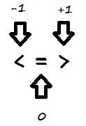

# Things to Read

https://medium.com/@sihui/what-the-heck-are-code-blocks-procs-lambdas-and-closures-in-ruby-2b0737f08e95 


# Useful stuff

## Jargon
**Refactoring** is just a fancy way of saying we're improving the structure or appearance of our code without changing what it actually does.

## The .split Method - Dividing and replacing parts of a user input
Next, we'll want to divide the user's input into individual words.

Ruby has a built-in method for this called .split; it takes in a string and returns an array. If we pass it a bit of text in parentheses, .split will divide the string wherever it sees that bit of text, called a delimiter. For example, `text.split(“,”)` tells Ruby to split up the string text whenever it sees a comma.

EG
```
puts "Input text to be redacted "
text = gets.chomp
puts "Word to be redacted "
redact = gets.chomp
words = text.split(" ")
words.each do |letter|
  if letter == redact
    print "REDACTED "
  else 
    print letter + " "
  end
end
```
----- 

### Additional questions:
What could you do to make sure your redactor redacts a word regardless of whether it's upper case or lower case?
```
puts "Input text to be redacted "
text = gets.chomp
puts "Word to be redacted "
redact = gets.chomp
words = text.split(" ")
words.each do |letter|
  if letter.downcase == redact.downcase
    print "REDACTED "
  else 
    print letter + " "
  end
end
```

### How could you make your program take multiple, separate words to REDACT?
```
puts "Input text to be redacted "
text = gets.chomp
puts "Input words to be redacted"
redact = gets.chomp
words = text.split(" ")
redacts = redact.split(" ")
words.each do |letter|
 if redact.include? letter
   print "REDACTED "
 else
   print letter + " "
 end
end
```
### How might you make a new redacted string and save it as a variable, rather than just printing it to the console? 

```
puts "Input text to be redacted "
text = gets.chomp
puts "Input words to be redacted"
redact = gets.chomp
words = text.split(" ")
redacts = redact.split(" ")
redacted_string = ""
words.each do |letter|
if redacts.include? letter
  redacted_string << "REDACTED "
else
  redacted_string << (letter + " ")
end
end
puts redacted_string
```

------ 
## Methods

A method is a reusable section of code written to perform a specific task in a program. You might be wondering why you need to separate your code into methods, rather than just writing everything out in one big chunk. It turns out there are a few good reasons to divide your programs into methods:

+ If something goes wrong in your code, it's much easier to find and fix bugs if you've organized your program well. Assigning specific tasks to separate methods helps with this organization.

+ By assigning specific tasks to separate methods (an idea computer scientists call separation of concerns), you make your program less redundant and your code more reusable—not only can you repeatedly use the same method in a single program without rewriting it each time, but you can even use that method in another program.

When we learn more about objects, you'll find out there are a lot of interesting things we can do with methods in Ruby.


--------
## .sort explained

https://stackoverflow.com/questions/26581619/rubys-operator-and-sort-method 

Before you can understand sorting objects. You need to understand the .sort method in Ruby. If you were to sort 5 cards with numbers on them, you could take a look at all of them, find the lowest one easily, and just pick that one as your first card (presuming you're sorting from lowest to highest, which Ruby does). When your brain sorts, it can look at everything and sort from there.
There are 2 main elements of confusion here that are rarely addressed:
1) Ruby can't sort in the way you think of the word "sort". Ruby can only 'swap' array elements, and it can 'compare' array elements.
2) Ruby uses a comparison operator, called the spaceship, to attribute numbers to help it 'sort'. Those numbers are -1,0,1. People erroneously think those 3 numbers are helping it 'sort' (eg. if there was an array with 3 numbers such a 10,20,30, then the 10 would be a -1, the 20 a 0, and the 30 a 1, and Ruby is just simplifying the sorting by reducing it to -1,0,1. This is wrong. Ruby can't "sort". It can't only compare).

Look at the spaceship operator. It's 3 individual operators lumped into one, the <, the =, and the >. When Ruby compares two variables, it results in one of these numbers.



That said, what does "results" mean? It DOESN'T mean that one of the variables is assigned a 0,1,-1. It simply is a way what Ruby can take two variables and do something with them. Now, if you just run:
```
puts 4 <=> 5
```
You'll get the result of -1, since whatever 'part' (eg. <, =, or >) of the comparison operator (spaceship) is true, gets the number that's assigned to it (as seen in the above picture). When Ruby sees this <=> with an array though, it has 2 things it will do to the array only: Leave the array alone OR swap the elements of the array.

If Ruby uses the <=> and gets a 1, it will swap the 2 elements of the array. If Ruby gets a result of -1 or 0, it will leave the array alone.

An example is if Ruby sees the array [2,1]. The sort method would make it pull in these figures like 2<=>1. Since the part of the spaceship (if you want to think of it like that) that's true is the > (ie. 2>1 is true), the result is '1' from Ruby. When Ruby sees a 1 result from the spaceship, it swaps the 2 elements of the array. Now the array is [1,2].

Hopefully at this point, you see that Ruby only compares with the <=> operator, and then swaps (or leaves alone) the 2 elements in the array it compares.

Understand the .sort method is an iterative method, meaning that it's a method that runs a block of code many times. Most people are introduced to the .sort method only after they've seen a methods such as .each or .upto (you don't need to know what those do if you haven't heard of them), but those methods run through the array 1 time ONLY. The .sort method is different in that it will run through your array as many times as it needs to so that it's sorted (by sorted, we mean compared and swapped).

To make sure you understand the Ruby syntax:
```
foo = [4, 5, 6] puts foo.sort {|a,b| a <=> b}
```
The block of code (surrounded by {}'s) is what Ruby would do any way when it sorts from lowest to highest. But suffice it to say that the first iteration of the .sort method will assign the variables between the pipes (a, b) the first two elements of the array. So for the first iteration a=4 and b=5, and since 4<5, that results in a -1, which Ruby takes it to mean to NOT swap the array. It does this for a second iteration, meaning a=5 and b=6, sees that 5<6, results in -1 and leaves the array alone. Since all the <=> results were -1, Ruby stops looping through and feels the array is sorted at [4,5,6].

We can sort from high to low by simply swapping the order of the variables.
```
bar = [5, 1, 9] puts bar.sort {|a,b| b <=> a}
```
Here's what Ruby is doing:

+ Iteration 1: Array [5,1,9]. a=5, b=1. Ruby sees the b<=>a, and says is 1 < 5? Yes. That results in -1. Stay the same.

+ Iteration 2: Array [5,1,9]. a=1, b=9. Ruby sees the b<=>a, and says is 9 < 1? No. That results in 1. Swap the 2 array elements. The array is now [5,9,1]

+ Iteration 3: Array [5,9,1]. Starting over b/c there was a +1 result in the array before going through it all. a=5, b=9. Ruby sees the b<=>a, says is 9<5? No. That results in 1. Swap. [9, 5, 1]

+ Iteration 4: Array [9,5,1]. a=5, b=1. Ruby sees the b<=>a, says is 1<5? Yes. That results in -1. Therefore, no swapping is performed. Done. [9,5,1].

Imagine an array with the number 50 for the first 999 elements, and a 1 for element 1000. You fully understand the sort method if you realize Ruby has got to go through this array thousands of times doing the same simple compare and swap routine to shift that 1 all the way to the beginning of the array.

Now, we can finally look at .sort when comes to an object.
```
def <=>(other) other.score <=> score end
```
This should now make a little more sense. When the .sort method is called on an object, like when you ran the:
```
@players.sort
```
it pulls up the "def <=>" method with the parameter (eg. 'other') which has the current object from @players (eg. 'whatever the current instance object is of '@players', since it's the sort method, it's eventually going to go through all of the elements of the '@players' array). It's just like when you try to run the puts method on a class, it automatically calls the to_s method inside that class. Same thing for the .sort method automatically looking for the <=> method.

Looking at the code inside of the <=> method, there must be a .score instance variable (with an accessor method) or simply a .score method in that class. And the result of that .score method should (hopefully) be a String or number - the 2 things ruby can 'sort'. If it's a number, then Ruby uses it's <=> 'sort' operation to rearrange all of those objects, now that it knows what part of those objects to sort (in this case, it's the result of the .score method or instance variable).

As a final tidbit, Ruby sorts alphabetically by converting it to numerical values as well. It just considers any letter to be assigned the code from ASCII (meaning since upper case letters have lower numerical values on the ASCII code chart, upper case will be sorted by default to be first).
Hope this helps!

----------
## Default Parameters
Let's start with the new bit of code you saw in exercise 1:
```
def alphabetize(arr, rev=false)
```
The first part makes sense—we're defining a method, alphabetize. We can guess that the first parameter is an array, but what's this rev=false business?
What this does is tell Ruby that alphabetize has a second parameter, rev (for "reverse") that will default to false if the user doesn't type in two arguments. You might have noticed that our first call to alphabetize in exercise 1 was just
alphabetize(books)
Ruby didn't see a rev, so it gave it the default value of false.
 
### Setting a Default for Hashes 
You don't have to settle for nil as a default value, however. If you create your hash using the Hash.new syntax, you can specify a default like so:
my_hash = Hash.new("Trady Blix")
Now if you try to access a nonexistent key in my_hash, you'll get "Trady Blix" as a result.

------------
## What's a Symbol?

You can think of a Ruby symbol as a sort of name. It's important to remember that symbols aren't strings:
```
"string" == :string # false
```

Above and beyond the different syntax, there's a key behavior of symbols that makes them different from strings. While there can be multiple different strings that all have the same value, there's only one copy of any particular symbol at a given time.

Symbols always start with a colon (:). They must be valid Ruby variable names, so the first character after the colon has to be a letter or underscore (_); after that, any combination of letters, numbers, and underscores is allowed.

Make sure you don't put any spaces in your symbol name—if you do, Ruby will get confused.
```
:my symbol # Don't do this!
:my_symbol # Do this instead.
```
### What are Symbols Used For?
Symbols pop up in a lot of places in Ruby, but they're primarily used either as hash keys or for referencing method names. (We'll see how symbols can reference methods in a later lesson.)
```
sounds = {
  :cat => "meow",
  :dog => "woof",
  :computer => 10010110,
}
```
Symbols make good hash keys for a few reasons:
+ They're immutable, meaning they can't be changed once they're created;
+ Only one copy of any symbol exists at a given time, so they save memory;
+ Symbol-as-keys are faster than strings-as-keys because of the above two reasons.

Converting between strings and symbols is a snap.
```
:sasquatch.to_s # ==> "sasquatch"
"sasquatch".to_sym # ==> :sasquatch
```
The .to_s and .to_sym methods are what you're looking for!

EG:
``` 
strings = ["HTML", "CSS", "JavaScript", "Python", "Ruby"]
symbols = Array.new
strings.each do |s|
  symbols.push(s.to_sym)
end 
```
Besides using .to_sym, you can also use .intern. This will internalize the string into a symbol and works just like .to_sym:
```
"hello".intern # ==> :hello
```
When you're looking at someone else's code, you might see .to_sym or .intern (or both!) when converting strings to symbols.

----
## Filtering Hashes

We know how to grab a specific value from a hash by specifying the associated key, but what if we want to filter a hash for values that meet certain criteria? For that, we can use .select.

```
grades = { alice: 100,
  bob: 92,
  chris: 95,
  dave: 97
}

grades.select { |name, grade| grade <  97 } # ==> { :bob => 92, :chris => 95 }

grades.select { |k, v| k == :alice } # ==> { :alice => 100 }
```

In the example above, we first create a grades hash that maps symbols to integers.

Then we call the .select method and pass in a block of code. The block contains an expression for selecting matching key/value pairs. It returns a hash containing :bob and :chris.

Finally, we call the .select method again. Our block looks only for the key :alice. This is an inefficient method of getting a key/value pair, but it shows that .select does not modify the hash.

(Here we're using "name" or "k" to stand for the key and "grade" or "v" to stand for the value, but as usual with blocks, you can call your variables whatever you like.)

### Eg

```
movie_ratings = {
  memento: 3,
  primer: 3.5,
  the_matrix: 5,
  truman_show: 4,
  red_dawn: 1.5,
  skyfall: 4,
  alex_cross: 2,
  uhf: 1,
  lion_king: 3.5
}
# Add your code below!
good_movies = movie_ratings.select do |key, value|
  value > 3
end
```
----
## Iterating Out Parts of a Hash

Ruby includes two hash methods, .each_key and .each_value, that do exactly what you'd expect:
```
my_hash = { one: 1, two: 2, three: 3 }

my_hash.each_key { |k| print k, " " } # ==> one two three

my_hash.each_value { |v| print v, " " } # ==> 1 2 3
```
### Eg
```
movie_ratings = {
  memento: 3,
  primer: 3.5,
  the_matrix: 3,
  truman_show: 4,
  red_dawn: 1.5,
  skyfall: 4,
  alex_cross: 2,
  uhf: 1,
  lion_king: 3.5
}
movie_ratings.each_key {|key| puts key} # puts the name of each movie
movie_ratings.each_value {|value| puts value} # puts the rating of each movie.
```
---
## Shortening "If"
### The Case Statement

if and else are powerful, but we can get bogged down in ifs and elsifs if we have a lot of conditions to check. Thankfully, Ruby provides us with a concise alternative: the case statement. The syntax looks like this:

```
case language
  when "JS"
    puts "Websites!"
  when "Python"
    puts "Science!"
  when "Ruby"
    puts "Web apps!"
  else
    puts "I don't know!"
end
```
The else is what the case statement will do if it doesn't match any of its when statements to the case (in this case, the value of language).

To make the code more concise, you can fold the statements:

```
case language
  when "JS" then puts "Websites!"
  when "Python" then puts "Science!"
  when "Ruby" then puts "Web apps!"
  else puts "I don't know!"
end
```
another example:
```
puts "Hello there!"
greeting = gets.chomp.downcase

# Add your case statement below!
case greeting 
  when "english" then puts "Hello!"
  when "french" then puts "Bonjour!"
  when "german" then puts "Guten Tag!"
  when "finnish" then puts "Haloo!"
  else puts "I don't know that language!"
end
```
### if and unless 
You've seen the Ruby if statement before:
```
if condition
  # Do something!
end
```
If the "do something" is a short, simple expression, however, we can move it up into a single line (as you saw in the last exercise). The syntax looks like this:
expression if boolean
Ruby will expect an expression followed by if followed by a boolean. The order is important. You can do this:
puts "It's true!" if true
but not this:
```
if true puts "It's true!"
```

It's also important to note that you don't need an end when you write your if statement all on one line.

#### Eg Simple Coin Toss game

```
assignments = {heads: 0, tails: 1}
puts "heads or tails?"
user_choice = gets.chomp.downcase.to_sym
flip = rand(2)
puts "heads" if flip == 0 
puts "tails" if flip == 1
puts "you lose" if assignments[user_choice] != flip
puts "you win" if assignments[user_choice] == flip
```
Alternatively, the unless condition works the other way around:

```
assignments = {heads: 0, tails: 1}
puts "heads or tails?"
user_choice = gets.chomp.downcase.to_sym
flip = rand(2)
puts "heads" if flip == 0 
puts "tails" if flip == 1
puts "you lose" unless assignments[user_choice] == flip
puts "you win" unless assignments[user_choice] != flip
```
### Ternary Conditional Expressions

An even more concise version of if/else is the ternary conditional expression. It's called "ternary" because it takes ***three arguments***: a boolean, an expression to evaluate if the boolean is true, and an expression to evaluate if the boolean is false.
The syntax looks like this:
boolean ? Do this if true: Do this if false
An example might be:

#### Eg
```
puts 3 < 4 ? "3 is less than 4!" : "3 is not less than 4."
```
#### Eg

```
assignments = {heads: 0, tails: 1}
puts "heads or tails?"
user_choice = gets.chomp.downcase.to_sym
flip = rand(2)
puts "heads" if flip == 0 
puts "tails" if flip == 1
puts assignments[user_choice] == flip ? "you win" : "you lose"
```
#### Eg
```
print "Enter a number: "
i = gets.to_i
puts "Your number is " +
(i > 10 ? "greater than" : "less than or equal to") +
" 10"
```
---
## Conditional Assignment

We've seen that we can use the = operator to assign a value to a variable. But what if we only want to assign a variable if it hasn't already been assigned? 
For this, we can use the conditional assignment operator: ||=. It's made up of the or (||) logical operator and the normal = assignment operator.

#### Eg
```
favorite_language ||= "ruby"
puts favorite_language
```
---

## Short-Circuit Evaluation
Recall that we have the boolean operators and (&&) and or (||) in Ruby. The && operator only returns true when the expressions on both sides of the operator are true; || returns true when one or the other or both of the expressions involved are true. 
Ruby does this via short-circuit evaluation. That means that Ruby doesn't look at both expressions unless it has to; if it sees
```
false && true
```
it stops reading as soon as it sees && because it knows false && anything must be false.

Remember how Ruby returns the result of the last expression it evaluated? We can use that to show short-circuit evaluation in action.

#### Eg
```
def a
  puts "A was evaluated!"
  return true
end

def b
  puts "B was also evaluated!"
  return true
end

puts a || b
puts "------"
puts a && b
```
results in:
```
A was evaluated!
true
------
A was evaluated!
B was also evaluated!
true
```

Because only false and nil are false values in Ruby, both strings are treated as true. Ruby knows true || anything is true, so in a || b, it only evaluates a. Since it might encounter a false in the b part of a && b, however, it has to evaluate b, which we see in the result!

----

## Basic Iterations techniques
Sooner or later, you're going to need to perform a repetitive task in your programs. Many programming languages allow you to do this with a for loop, and while Ruby does include for loops, there are better tools available to us.

### .times
If we want to do something a specific number of times, we can use the .times method, like so:
```
5.times { puts "Odelay!" }
# Prints 5 "Odelay!"s on separate lines
If we want to repeat an action for every element in a collection, we can use .each:
[1, 2, 3].each { |x| puts x * 10 }
# Prints 10, 20, 30 on separate lines
```
#### Eg
```
my_array = [1, 2, 3, 4, 5, 6, 7, 8, 9, 10]
my_array.each {|x| puts x if x%2==0}
# puts only even numbers from the array
```
### .upto .downto
If we know the range of numbers we'd like to include, we can use .upto and .downto. This is a much more Rubyist solution than trying to use a for loop that stops when a counter variable hits a certain value.
We might use .upto to print out a specific range of values:
```
95.upto(100) { |num| print num, " " }
# Prints 95 96 97 98 99 100
and we can use .downto to do the same thing with descending values.
```
## Debugging  
### Call and Response
Remember when we mentioned that symbols are awesome for referencing method names? Well, .respond_to? takes a symbol and returns true if an object can receive that method and false otherwise. For example,
```
[1, 2, 3].respond_to?(:push)
would return true, since you can call .push on an array object. However,
[1, 2, 3].respond_to?(:to_sym)
would return false, since you can't turn an array into a symbol.
```
## Blocks
### The collect method
The collect method takes a block and applies the expression in the block to every element in an array. Check it out:
```
my_nums = [1, 2, 3]
my_nums.collect { |num| num ** 2 }
# ==> [1, 4, 9]
```

If we look at the value of my_nums, though, we'll see it hasn't changed:
```
my_nums
# ==> [1, 2, 3]
```

This is because .collect returns a copy of my_nums, but doesn't change (or mutate) the original my_nums array. If we want to do that, we can use .collect! with an exclamation point:

```
my_nums.collect! { |num| num ** 2 }
# ==> [1, 4, 9]
my_nums
# ==> [1, 4, 9]
```
### Blocks and yielding

A block is simply a chunk of code, and yield allows you to "inject" that code at some place into a function. So if you want your function to work in a slightly different way, you don't have to write a new function, instead you can reuse the one you already have, but give it a different block.

For example, consider a function that will print the members of an Array, but number them, like this: if you give it ["apple","banana"], it should print
```
1. apple
2. banana
```
Easy enough, right? There are several ways to do this, but I'll just use each and a counter. Instead of incrementing the counter via += 1, I'd like to use the next method (you'll see why in a moment). Here's how the next method works: 3.next equals 4, 99.next is 100 and so on. So here's our method (without yield):
```
def print_list(array, first = 1)
  counter = first
  array.each do |item|
    puts "#{counter}. #{item}"
    counter = counter.next
  end
end
```
Now when we call print_list(["Ruby", "Python", "C"]), it'll print
```
1. Ruby
2. Python
3. C
```
The second parameter first is optional (it defaults to 1 because of the first=1 above) and it tells our function where to start counting:
```
print_list(["a","b","c"], 99)
```
will print
```
99. a
100. b
101. c
```
Because I chose next over += 1 to increment the counter, and because Ruby is really awesome, we can use strings instead of numbers to label the list items: "A".next is "B", and so forth. Thus
```
print_list(["Ruby", "Python", "C"], "X")
```
will print:
```
X. Ruby
Y. Python
Z. C
```
Great, right? But what if we wanted a different format for the item labels? Say, (1), (2), (3) instead of 1., 2., 3.? Our function does the formatting in this line:
```
puts "#{counter}. #{item}"
```
So instead of having two (almost identical) functions – one for 1. 2. and one for (1) (2) (and so on, one for every possible idea), we're going to export that formatting thing into a block, and have just a yield inside the function:
```
# function print_list, line 4:
puts "#{yield counter} #{item}"
```
Now we can have a block handle the formatting:
```
print_list( [1,2,3], 23 ) { |n| "<#{n}>"}

# produces: 

<23> 1
<24> 2
<25> 3
```
Now I hope you see how this yield adds flexibility to your method. You can, for instance, have something like this:
```
print_list( ["alpha","beta","gamma"], 5 ) do |n|
  "[#{100*n}]:"
end
```
----

## Procs
Procs are easy to define! You just call Proc.new and pass in the block you want to save. Here's how we'd create a proc called cube that cubes a number (raises it to the third power):
```
cube = Proc.new { |x| x ** 3 }
```
We can then pass the proc to a method that would otherwise take a block, and we don't have to rewrite the block over and over!
```
[1, 2, 3].collect!(&cube)
# ==> [1, 8, 27]
[4, 5, 6].map!(&cube)
# ==> [64, 125, 216]
```
(The .collect! and .map! methods do the exact same thing.)

The & is used to convert the cube proc into a block (since .collect! and .map! normally take a block). We'll do this any time we pass a proc to a method that expects a block.

#### Eg
```
floats = [1.2, 3.45, 0.91, 7.727, 11.42, 482.911]
round_down = Proc.new {|x| x.floor}
ints = floats.collect(&round_down)
ints = round_down(floats)
print ints

```
The same result achieved using methods only would look as follows:

```
floats = [1.2, 3.45, 0.91, 7.727, 11.42, 482.911]
def round_down(x)
 x.collect {|y| y.floor}
end
ints = round_down(floats)
```


# Broken Stuff

# Working Stuff
## Looped if statement converting user input into Daffy speak

```
while true
  puts "Talk to me Daffy! "
  user_input = gets.chomp
  user_input.downcase!
  if user_input.include? "s"
    user_input.gsub!(/s/,"th")
    puts "Daffy you have said: #{user_input}"
    break
  end
  puts "No “s” to deal with, try again!"
end
```
## Mini Game - Can You Break Through the Wall? - using variables

```
# weapon list with attack values
gun = 32
bat = 20
fist = 4
# obstacle with health value of "10"
wall = 10
print "You need to get through this wall. What weapon would you like to try?
Your fist, bat or gun? "
user_input = gets.chomp
# function linking the user input to the variables
if user_input.downcase == "gun"
        user_input_var = gun
    elsif user_input.downcase == "bat"
        user_input_var = bat
    elsif user_input.downcase == "fist"
        user_input_var = fist
    else
        print "Try a different input"
end
# Test evaluating if the user breaks through the wall?
if user_input_var < wall 
    print "That didn't work. "
    elsif user_input_var == wall
        print "Try again! There’s a crack in the wall. "
    else user_input_var > wall
        print "You broke through the wall! "
end
puts "Your weapon of choice was: #{user_input}"
```

## Mini Game - Can You Break Through the Wall? - updated using hashes

```
# Defining the variables
variables = {
 "gun" => 32,
 "bat" => 20,
 "fist" => 4,
 "wall" => 10,
}

# Taking user input
print "You need to get through this wall. What weapon would you like to try?
Your fist, bat or gun? "
user_input = gets.chomp

# Testing user input against wall strength 
if variables[user_input] < variables["wall"]
 print "That didn't work. "
elsif variables[user_input] == variables["wall"]
 print "Try again! There’s a crack in the wall. "
else variables[user_input] > variables["wall"]
 print "You broke through the wall! "
end

# Concluding Statement
puts "Your weapon of choice was a: #{user_input}"
```
-----

## Movie Database
```
movies = {Momento: 10}
puts "What would you like to do?"
puts "Add a movie? - type 'add' - " 
puts "Update a movie? - type 'update' - "
puts "Display a moveie? - type 'display' - "
puts "Delete a movie? - type 'delete' - " 
choice = gets.chomp.downcase

case choice
  when "add"
  	puts "Enter movie title"
  	title = gets.chomp.to_sym.capitalize
  	puts "Enter movie rating"
  	rating = gets.chomp.to_i
  	if movies[title].nil?
  		movies[title] = rating
  		puts "#{title} has been added, with a rating of: #{rating}."
    else
      puts "#{title} has already been added, with a rating of #{movies[title]}."
	end
	when "update"
  	puts "Enter movie title"
  	title = gets.chomp.to_sym.capitalize
  	if movies[title].nil?
      puts "#{title} has not previously been rated, please add to database first."
    else 
      puts "Enter movie rating"
  		rating = gets.chomp.to_i
      movies[title] = rating
      puts "#{title} has been updated with a rating of: #{rating}."
    end
	when "display"
  	movies.each {|movie, rating| puts "#{movie}: #{rating}"}
	when "delete"
  	puts "Enter movie title"
  	title = gets.chomp.to_sym.capitalize
  	if movies[title].nil?
      puts "#{title} does not exist within the database."
		else
      movies.delete(title)
      puts "#{title} has been removed from the database."
    end
  else
  puts "Error! Please review input."
end
```

---

## Simple Coin Toss game

```
assignments = {heads: 0, tails: 1}
puts "heads or tails?"
user_choice = gets.chomp.downcase.to_sym
flip = rand(2)
puts "heads" if flip == 0 
puts "tails" if flip == 1
puts "you lose" if assignments[user_choice] != flip
puts "you win" if assignments[user_choice] == flip
```
-----
